# 네트워크의 구성 요소

>  What is internet?

## 교과목 목표

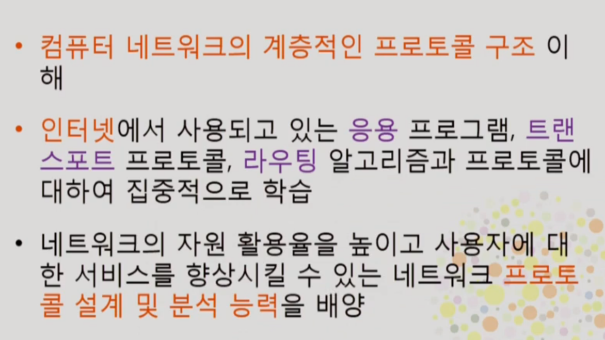

- 프로토콜 : 통신 규약
- Top-Down으로 네트워크 계층 설명 예정

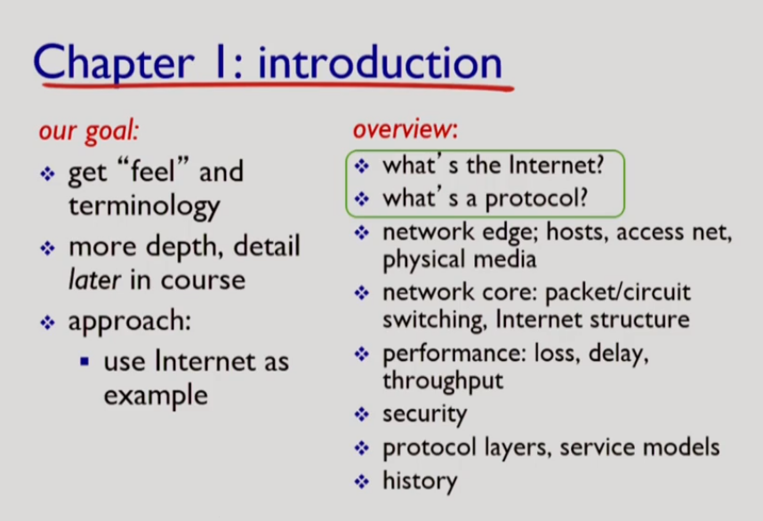

## 인터넷이란

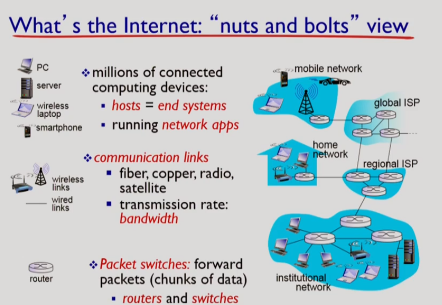

- host = end system = 사용자 컴퓨터나 서버
- router = 사용자의 메세지가 목적지를 찾아가게 해주는 장치
- link = 물리적 회선 라우터들끼리 연결
- 가장자리에 host, 중앙에 스위치와 라우터 - link로 연결

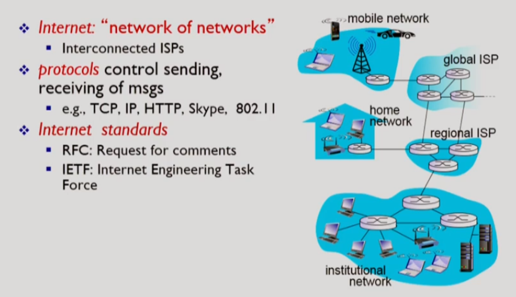

- 인터넷 = 네트워크들이 모인 네트워크
- 프로토콜 = 인터넷에서 메세지를 보내는 일련의 규칙
- 표준화가 중요
- IETF기관에서 RFC 표준안 발표

## 프로토콜이란

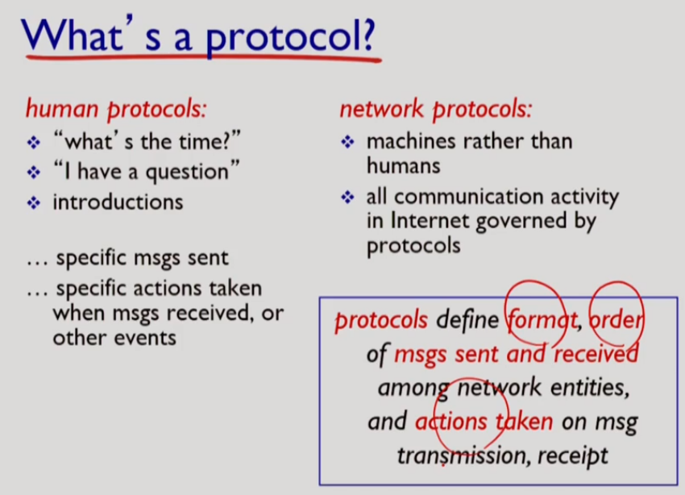

- 포멧, 메세지 순서, 메세지를 받았을 때의 action 등이다

## Network Edge

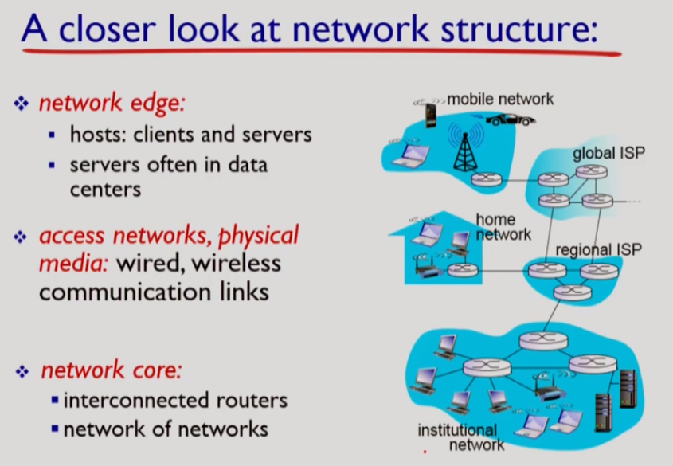

- access network : host를 네트워크에 연결시켜주는
- bandwidth : 단위 시간당 실어나를 수 있는 비트 수
- bandwidth가 shared(다른 사람과 공유하는지)냐 dedicated이냐

### Digital subscriber line(DSL)

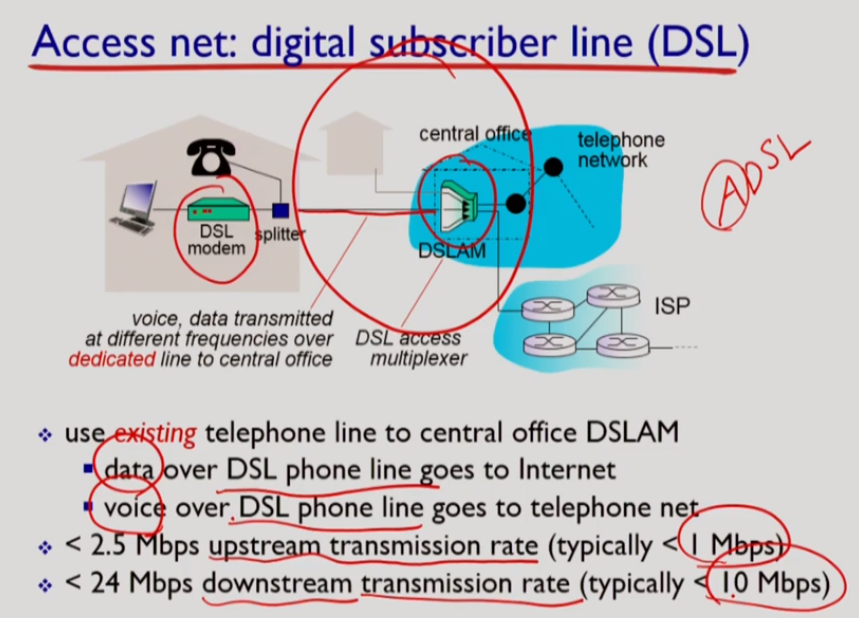

- 전화 회사가 제공해주는 access network
- dedicated link
- DSLAM이 전화와 네트워크를 분리해준다
- 다운로드를 업로드보다 많이 한다

### Cable network

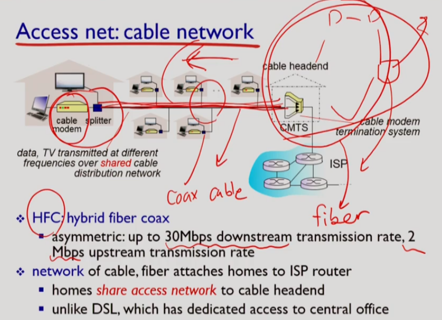

- 케이블 회사가 제공하는 access network
- shared link
- **HFC** : hybrid fiber coax (fiber cable(광케이블)과 coax cable(동축케이블, 각 가정으로)을 섞어서 사용)
- 다운로드가 최대 30Mbps (다른 집과 share할 수 있으므로 최대가 붙는다), 업로드는 최대 2Mbps

### 집의 네트워크

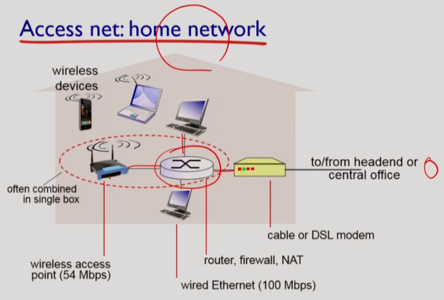

- 라우터가 여러 end system을 묶어서 네트워크에 연결

### 기관의 네트워크

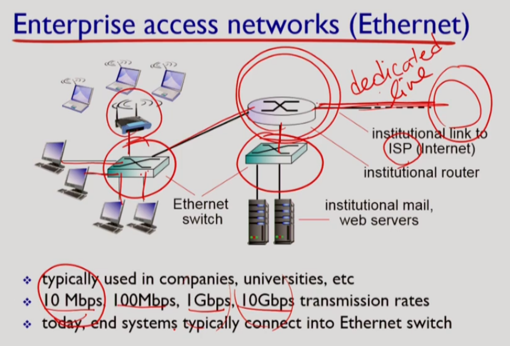

- ISP(Internet Service Provider)로 직접 연결(dedicated)
- 이더넷 스위치로 묶어서 학교 전체를 엮는 라우터에 물리고 직접 ISP에 연결
- 전화나 케이블 회사가 제공하는 네트워크가 없다

### Wireless access network

- 와이파이는 건물 안에서만, 대역폭이 넓다
- cellular network = wide-area wireless network
- 약어가 많다

# 네트워크의 구성 요소

>  Network edge, Network core

### Host

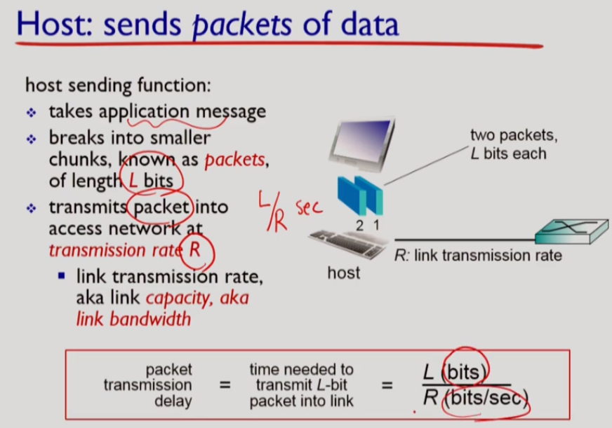

- 패킷 하나를 호스트에서 내보내는데 걸리는 시간 L/R(sec)
- host의 역할 : application message를 packet으로 잘라서 access network로 내보냄

### link

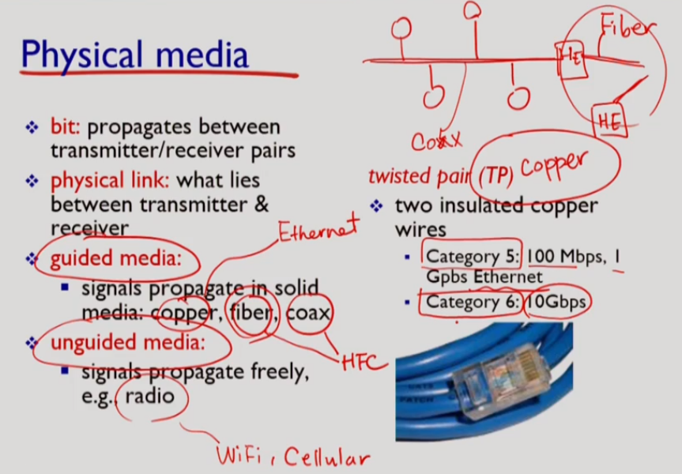

- guided media : 물리적인 wire를 사용
  - copper(= twisted pair) : Ethernet
    - Category 5 : 100 Mbps, 1Gbps Ethernet 지원
    - Category 6 : 10Gbps
  - fiber : HFC (Hybrid Fiber Coax), 지원하는 transmission rate가 높다, light pulse를 signal로 전달, transmission rate가 매우 높고 error rate가 낮다
  - coax : HFC, 지원하는 transmission rate가 더 높고 stable해서 broadband link
- unguided media : electromagnetic spectrum(전자기 스펙트럼)을 사용해 공기 중 전파
  - radio - WiFi, Cellular
  - noise에 굉장히 민감

## Network Core

souce에서 destination으로 정보를 전달하는 두가지 방식

### Circuit switching

- 전화 네트워크에서 사용
- 메세지 전달 전 call setup과정을 거친다
- call up :
  - source로부터 destination까지의 경로를 설정
  - resource reservation
  - 자원을 분할하는 방식이 있어야 한다
  - FDM(Frequency-division multiplexing)- frequency 대역을 나눠서 사용자마다 나눈다, TDM(Time-division multiplexing) - 시간으로 잘라서 사용

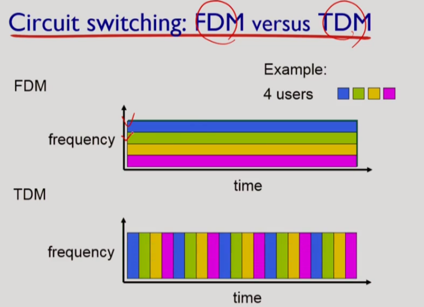

- 할당된 connection 사이를 다른 사용자와 share 할 수 없어서 순간적으로 데이터 송수신이 많은 인터넷과 같은 데이터 네트워크에는 비효율적이다

### Packet Swtching

- Call Setup이 없고 자원 예약도 없다
- 각 data transmittion이 full link capacity를 이용
- 하나의 메세지 크기가 너무 크면 회선을 독점하므로 자원 이용이 비효율적이므로 메시지를 packet이라는 chunk로 자른다
- 각 packet에 목적지 주소가 명시되어야 한다
- store-and forward : 라우터는 packet을 전체를 다 받고 보내야한다

#### store-and-forward

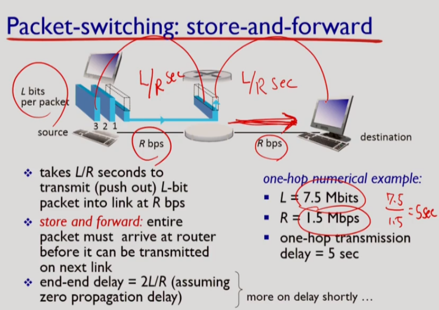

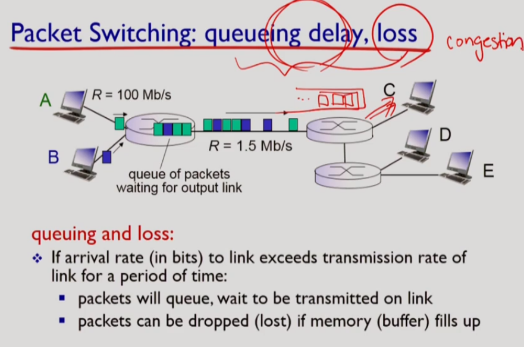

- congestion : queueing delay가 심해지고 큐가 쌓여 버퍼가 가득차서 loss가 나는 상황

### Packet switching vs circuit switching

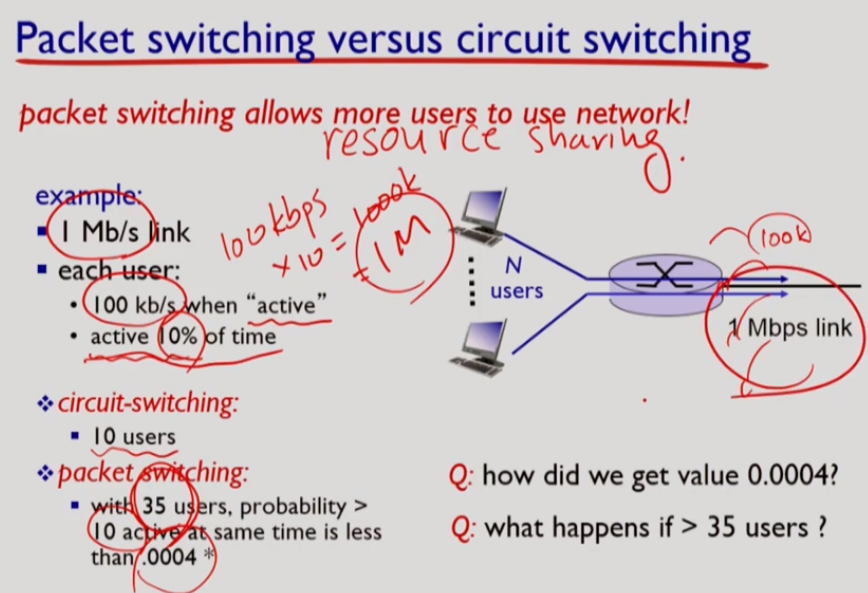

- packet switching이 resuorce sharing이 훨씬 효율적으로 일어난다
- 하지만 resource를 예약하지 않으므로 congestion이 발생할 수 있다
- streaming data에서는 delay가 중요한데 packet switching은 보장하지 못 한다

## Internet structure : network of network

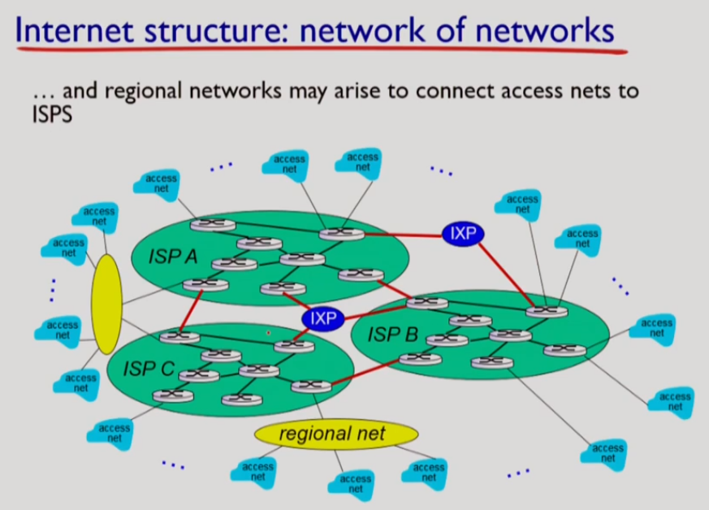

- 소규모 지역 ISP에서 대규모 ISP까지 연결
- 서로에게 consumer와 provider가 된다
- IXP(Internet Exchange Point) : ISP끼리 연결시켜주는 인터넷 연동 서비스
- Multi-tier hierarchy(계층)
- Point-of-presence : consumer isp들에게 인터넷에 접속하게 해주기 위해서 provider isp들의 라우터에 연결할 수 있게 해주는 접속점
- peering : 같은 level에 있는 다른 isp들과 연결 - settlement-free 때문에 연결

- Settlement-free : 통신량이 많은 RISP 간에 직접 peering link를 통해 cost, delay를 줄이는 것
- Multi-home : higher level ISP를 여러개 두는 것

- Content Provider Network 
  - Google, Microsoft 등이 만든 자신들만의 네트워크

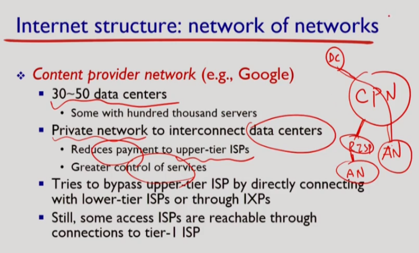

## Summary

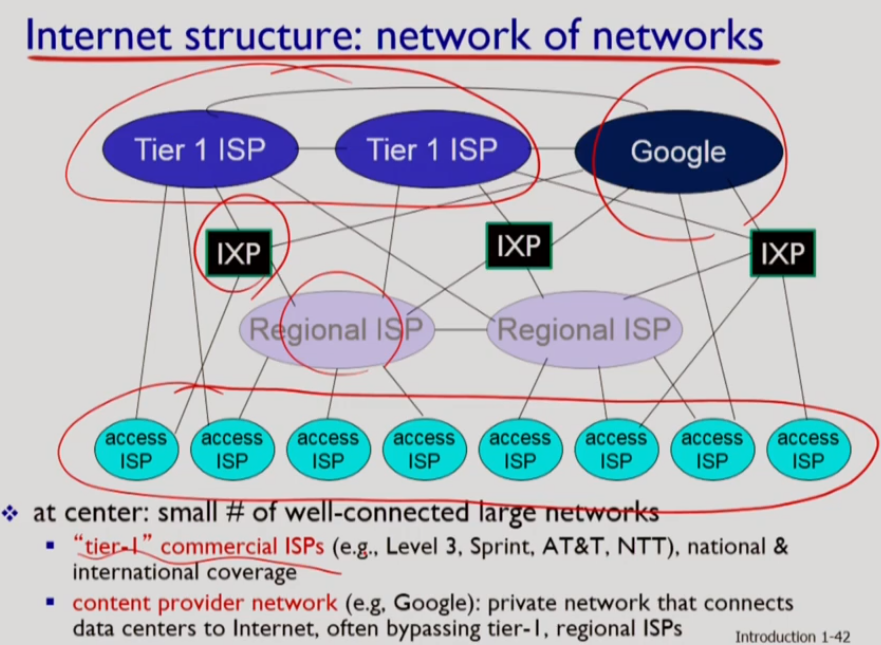

# 네트워크의 구성 요소

>  Delay, loss, throughput in networks, Protocol layers, service models, Networks under attack: security, Internet history

- Delay

  - **Processing Delay**
    - 패킷을 프로세싱할 때 발생하는 딜레이다.
    - 한 홉(hop은 컴퓨터 네트워크에서 출발지와 목적지 사이에 위치한 경로의 한 부분)을 건너오는데 오류가 없었는지 체크하고, 다음에 어디로 보내줄지 결정하는 등 패킷을 Processing 하는데 발생하는 딜레이
  - **Queueing Delay**
    - 패킷이 라우터에서 기다리는 시간을 Queueing Delay라고 하고 **유일하게 가변적**이다.
  - **Transmission Delay**
    - 패킷을 링크에 밀어 넣는데 걸리는 시간, 패킷의 길이/Bandwidth
  - **Propagation Delay**
    - 비트가 다음번 노드에 가기까지 걸리는 시간

  ### Loss

  - 라우터 내의 버퍼나 TCP내의 버퍼가 가득 찬다면 패킷 손실이 발생한다. Loss가 생기거나 전송 속도가 급격하게 느려지는 상황을 Congestion이라고 한다.
  - 저번 글에 굵은 글씨로 강조 표시했던 인터넷의 원칙을 떠올려보자. 인터넷 라우터는 Congestion Control을 하지 않고 오로지 전송만 담당한다. Congestion Control은 TCP에서 담당한다.
  - Loss가 일어나서 재전송을 해야 할 경우 속도 저하가 일어난다.

  

  ### Throughput

  - 출발지(Source)로부터 목적지(Destination)까지 배달한 데이터의 양이다.
  - Capacity가 가장 작은 링크가 있으면 여기서 병목현상이 일어난다. 주로 엣지에서 발생한다.

  

  ### Protocol

  - 계층적인 프로토콜

    - 유지 보수가 편리해진다.
    - 모듈화 된 프로토콜로 기능들을 캡슐화해서 구현할 수 있다.

  - Internet Protocol Stack

    - OSI 7 계층의 애플리케이션, 프레젠테이션, 세션 계층을 하나로 묶어서 애플리케이션 계층이라고 정의한다.

    - 1. Application 계층 : **유저가 만든 데이터를 Message**라는 형식으로 만든다. -> PDU: **Message**

    - 2. Transport 계층 : **Process 간 통신을 담당**한다. header(t)를(어디로 갈지) 추가 -> PDU: **Segment**

    - 3. Network 계층 : Routing을 통해서 홉을 거쳐 **Host 간 통신**을 담당한다 header(n)를 추가-> PDU: **Datagram**

    - 4. Link 계층 : 네트워크 장비 간 통신을 담당한다 header(l)를 추가->PDU: Frame

      - 길 찾기 기능(Routing)은 담당하지 않고 그저 전달만 담당한다.

    - 5. Physical 계층 : 물리적으로 데이터를 실어 나르는 역할을 담당한다.

   

  PDU : Protocol Data Unit. 각 프로토콜 계층에서의 데이터를 지칭한다.

---

# 정리

### network edge

네트워크의 가장자리. 수많은 end system 이 존재한다.

### Network core

전체 네트워크 시스템의 중앙에 위치하여 데이터를 전송하는 핵심적인 역할을 함. 수많은 라우터들이 그물처럼 얽혀있는 구조.

### Circuit switching

* 회선 교환 방식
  * 하나의 회선을 할당받아 데이터를 주고받는 방식
  * 통신을 위한 연결이 필요하며, 연결이 되고나면 source 로 부터 destination 까지 도착하는데 사용되는 회선 전체를 독점하기 때문에 다른사람이 끼어들 수 없다.
  * 전화와 같은 실시간 통신에 사용된다. 따라서 속도와 성능이 일정하다.

### packet switching

* 패킷 교환 방식
  * 데이터를 패킷단위로 쪼개서 전송하는 방식
  * Store and forward : 다음링크로 전송하기 전에 저장을 한뒤 전달하는 방식 사용
  * 패킷의 헤더에 source 와 destination이 있음
  * 라우팅 알고리즘을 이용하여 경로를 설정하고, 중간의 라우터들을 거쳐 최종 목적지에 도달하게 된다.
  * 이러한 과정에서 패킷은 다음 라우터로 이동하기 위해 큐에서 대기(queueing) 하는데, 수용할 수 있는 큐의 범위를 초과하게 되면 손실(loss)이 발생한다.

| Circuit Switching    | Packet Switching     |
| -------------------- | -------------------- |
| No store and forward | store and forward    |
| dedicated            | shared               |
| Bandwidth wastage    | No Bandwidth wastage |
| Reserved             | Not Reserved         |
| Less Delay           | Higher Delay         |
| Telephone line       | Internet line        |
| Highly Reliable      | Less Reliable        |
| Call Setup           | No Call Setup        |

### Queueing delay

* 단위 시간동안 도착하는 패킷의 수가 output link의 capacity 를 넘어설 때 라우터의 queue에 패킷이 대기 상태로 쌓이게 되어, delay 가 발생하는 것
* 만약 queue가 가득차서 더이상 패킷을 받을 공간이 없다면 패킷 loss 발생

### Throughput

* 네트워크상의 어떤 노드나 터미널로부터 또 다른 터미널로 전달되는 단위 시간당 데이터량

### spoofing

* 다른사람의 컴퓨터 시스템에 접근할 목적으로 IP주소를 변조한 후 합법적인 사용자인 것처럼 위장하여 시스템에 접근함으로써 나중에 IP주소에 대한 추적을 피하는 해킹 기법의 일종

### sniffing

* 네트워크 상에 지나다니는 패킷들을 캡처하여 그 안에 있는 내용을 들여다보는 기술

### Best effort

* 양단간 사용자에게 네트워크측에서 보장은 못하지만, 최선의 서비스 제공을 하려는 서비스 모델

### Encapsulation & Decapsulation

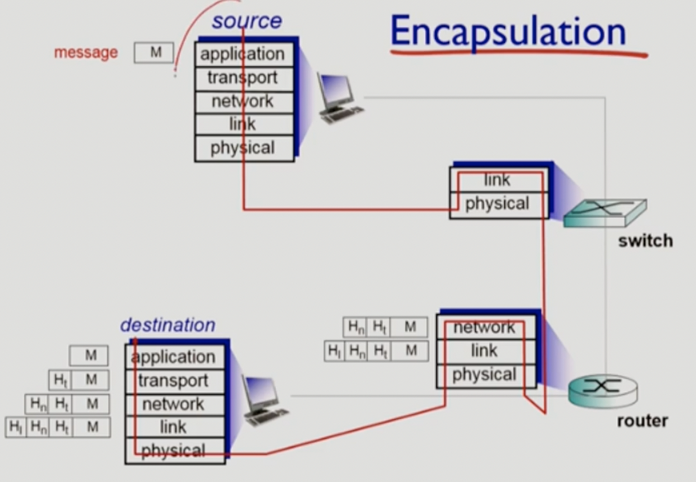

### TCP 와 UDP의 차이

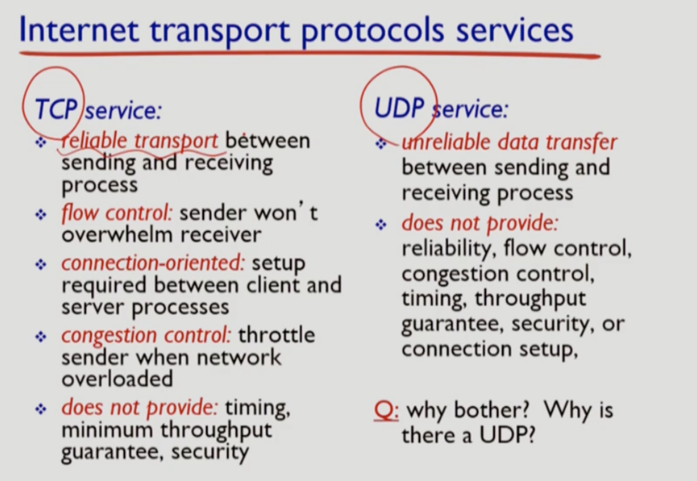
