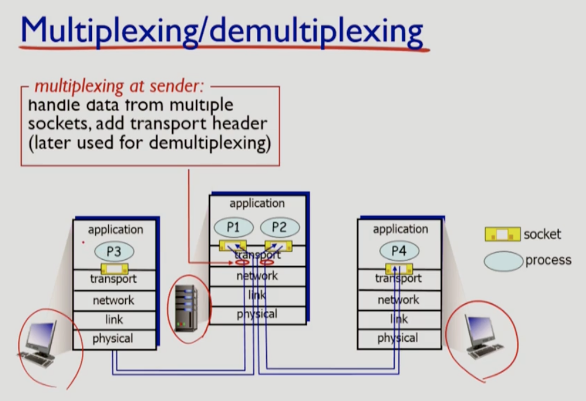
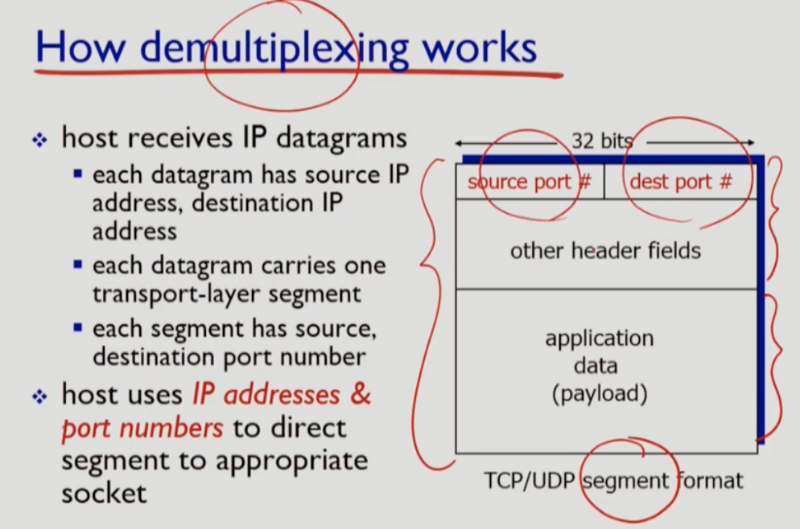
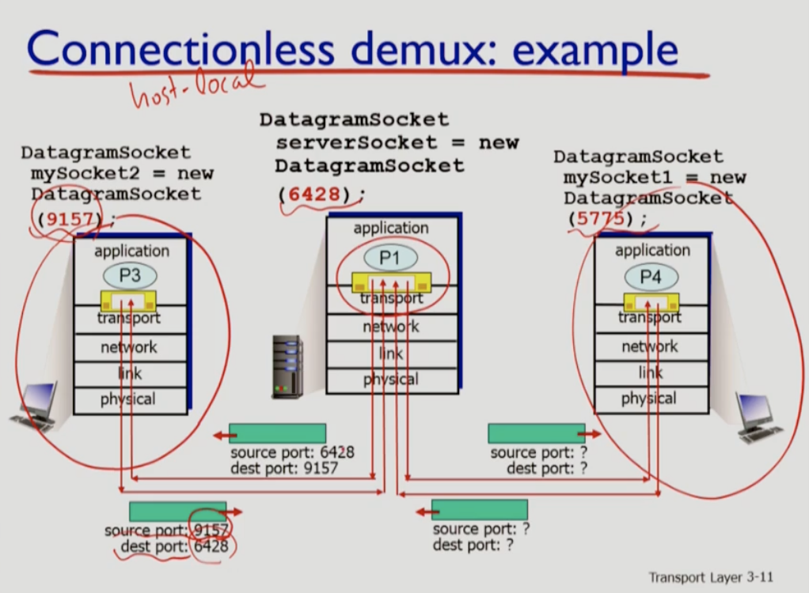
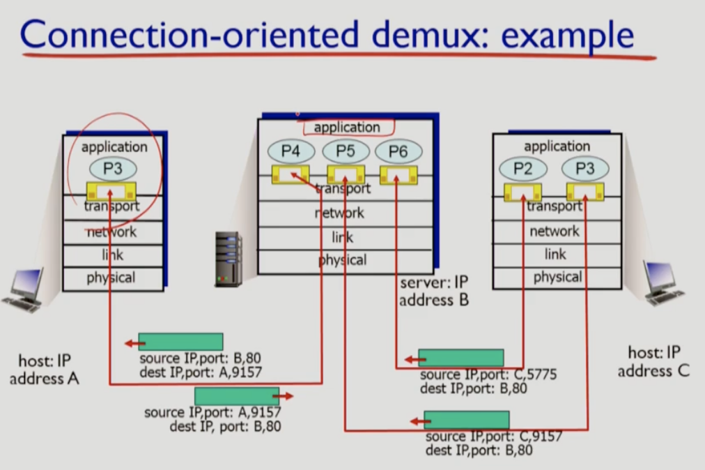

# 3. Transport Layer

### Multiplexing/demultiplexing

### UDP checksum

* 체크섬(checksum) 이란 네트워크를 통해서 전송된 데이터의 값이 변경되었는지 (무결성) 를 검사하는 값으로, 이를 통해 수신된 데이터에 오류가 없는지 여부를 확인한다.
* UDP Checksum 을 계산하기 위해서는 IP Header 와 UDP header에 있는 일부 정보들을 가져와 IPv4 Pseudo Header 를 만든 후에 계산해 줘야 한다.

### TCP Sequence number & ACK number

### TCP : Flow Control (흐름제어)

송신측과 수신측의 데이터 처리 속도 차이를 해결하기 위한 기법

* stop and wait
* Sliding window

### TCP : Congestion Control (혼잡제어)

송신측의 데이터 전달과 네트워크의 데이터 처리 속도 차이를 해결하기 위한 기법