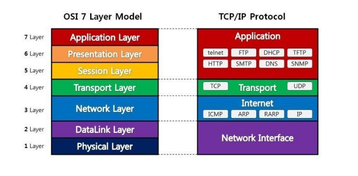
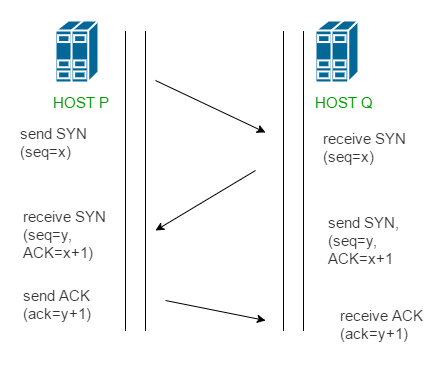
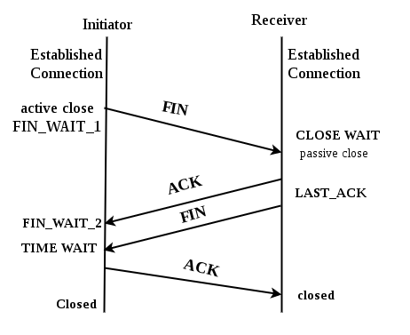
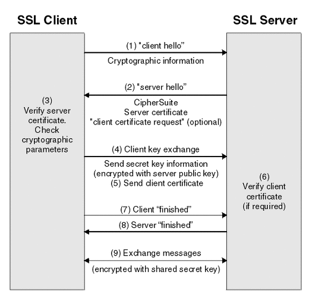

# Network 

## OSI 7계층 & TCP/IP 5계층 (주형)

통신이 일어나는 과정을 단계별로 파악하기 위해 네트워크에 통신이 일어나는 과정을 7단계로 나눈 것.

- 7 계층(응용 계층): 사용자와 직접 상호작용하는 응용 프로그램들이 포함된 계층, HTTP, FTP, SMTP, POP3, IMAP, Telnet 등과 같은 프로토콜이 있고 사용자 인터페이스, 전자우편, 데이터베이스 관리 등의 서비스를 제공한다. 데이터 전송 단위 -  메시지(message)
- 6 계층(표현 계층): 데이터의 형식(Format)을 정의하는 계층. 데이터 전송 단위 -  메시지(message)
- 5 계층(세션 계층): 컴퓨터끼리 통신을 하기 위해 세션을 만드는 계층, 데이터가 통신하기 위한 논리적인 연결. 데이터 전송 단위 -  메시지(message)
- 4 계층(전송 계층): 최종 수신 프로세스로 데이터의 전송을 담당하는 계층, TCP/UDP 프로토콜을 사용하여 통신을 활성화하는 계층,  패킷 생성 및 전송. 데이터 전송 단위 - TCP일 때 Segment  / UDP일 때 Datagram
-  3 계층(네트워크 계층): 패킷을 목적지까지 가장 빠른 길로 전송하기 위한 계층(라우팅). 데이터 전송 단위 - 패킷(packet)
- 2 계층(데이터링크 계층): 데이터의 물리적인 전송과 에러 검출, 흐름 제어를 담당하는 계층, 맥 주소로 통신을 하는 계층으로 전송되는 단위를 프레임, 장비는 브리지, 스위치가 있다. 데이터 전송 단위 - 프레임(frame)
- 1 계층(물리 계층): 데이터를 전기 신호로 바꾸어주는 계층, 케이블, 리피터, 허브를 통해 데이터 전송. 데이터 전송 단위 - 비트(bit)

## [TCP] 3 way handshake & 4 way handshake (다같이)

TCP의 정확한 전송 보장을 위해 클라이언트와 서버가 연결할 때 진행하는 과정인 3 way handshake

1. 클라이언트가 서버에게 SYN 패킷을 보낸다. 클라이언트는 SYN을 보내고 SYN/ACK 응답을 기다리는 SYN_SENT **상태**가 된다.
2. 서버가 SYN을 받고 클라이언트로 받았다는 신호인 ACK와 SYN을 보낸다. 서버는 클라이언트가 다시 ACK으로 응답하기를 기다리고 SYN_RECEIVED 상태가 된다.
3. 클라이언트는 서버의 응답인 ACK와 SYN을 받고 ACK를 서버로 보낸다. 이 후 클라이언트와 서버는 ESTABLISHED 상태

연결 성립 후 통신이 끝나면 해제할 때 진행하는 과정인 4 way handshake

1. 클라이언트는 서버에게 연결을 종료한다는 FIN 플래그를 보낸다.
2. 서버는 FIN을 받고, 확인했다는 ACK를 클라이언트에게 보낸다. (이때 모든 데이터를 보내기 위해 CLOSE_WAIT 상태가 된다)
3. 데이터를 모두 보냈다면, 연결이 종료되었다는 FIN 플래그를 클라이언트에게 보낸다.
4. 클라이언트는 FIN을 받고, 확인했다는 ACK를 서버에게 보낸다. (아직 서버로부터 받지 못한 데이터가 있을 수 있으므로 TIME_WAIT을 통해 기다린다.)

- 서버는 ACK를 받은 이후 소켓을 닫는다 (Closed)
- TIME_WAIT 시간이 끝나면 클라이언트도 닫는다 (Closed)

## TCP/IP (흐름제어/혼잡제어) (요셉)

## UDP (성우)

## TCP와 UDP 차이 (미현)

## SYN Flooding (주형)

TCP의 3-way-handshake의 2단계인 Server가 Client에게 SYN패킷과 ACK패킷을 전달하고  메모리 공간인 백로그 큐에 이 연결을 저장하고 응답을 기다리는 과정에서 실제로 존재하지 않는 클라이언트 IP로 응답이 없는 연결을 초기화하기 전에 또 새로운 1단계 요청만을 무수히 보내어 백로그 큐를 포화 상태로 대기해서 다른 서비스를 계속할 수 없게 하는 공격

## 프로토콜 (요셉)

## TCP(Transmission Control Protocol) / IP(Internet Protocol) (성우)

## ARP - 네트워크 계층에서 사용하는 주소 결정 프로토콜 / RARP (미현)

## 대칭키 & 공개키 (다같이)

대칭키 - 똑같은 개인키를 송수신자가 공유하여 정보를 암복호화 하는 것.

공개키 - 공개키와 개인키를 각각 암호화, 복호화에 적용하여 암복호화 하는 것.

- 상대방의 공개키를 통한 암호화, 상대방이 개인키를 통한 복호화
  - 정보 자체에 대한 암호화가 필요할 때 사용
- 자신의 개인키를 통한 암호화, 자신의 공개키를 통한 복호화
  - 정보를 송신한 사람의 신원에 대한 정보가 필요할 때 사용(전자서명)

https://universitytomorrow.com/22 참고

##  TLS/SSL HandShake (다같이)

1. 클라이언트는 서버에게 `client hello` 메시지를 담아 서버로 보낸다. 이때 암호화된 정보를 함께 담는데, `버전`, `암호 알고리즘`, `압축 방식` 등을 담는다.
2. 서버는 클라이언트가 보낸 암호 알고리즘과 압축 방식을 받고, `세션 ID`와 `CA 공개 인증서`를 `server hello` 메시지와 함께 담아 응답한다. 이 CA 인증서에는 앞으로 통신 이후 사용할 대칭키가 생성되기 전, 클라이언트에서 handshake 과정 속 암호화에 사용할 공개키를 담고 있다.
3. 클라이언트 측은 서버에서 보낸 CA 인증서에 대해 유효한 지 CA 목록에서 확인하는 과정을 진행한다.
4. CA 인증서에 대한 신뢰성이 확보되었다면, 클라이언트는 난수 바이트를 생성하여 서버의 공개키로 암호화한다. 이 난수 바이트는 대칭키를 정하는데 사용이 되고, 앞으로 서로 메시지를 통신할 때 암호화하는데 사용된다.
5. 만약 2번 단계에서 서버가 클라이언트 인증서를 함께 요구했다면, 클라이언트의 인증서와 클라이언트의 개인키로 암호화된 임의의 바이트 문자열을 함께 보내준다.
6. 서버는 클라이언트의 인증서를 확인 후, 난수 바이트를 자신의 개인키로 복호화 후 대칭 마스터 키 생성에 활용한다.
7. 클라이언트는 handshake 과정이 완료되었다는 `finished` 메시지를 서버에 보내면서, 지금까지 보낸 교환 내역들을 해싱 후 그 값을 대칭키로 암호화하여 같이 담아 보내준다.
8. 서버도 동일하게 교환 내용들을 해싱한 뒤 클라이언트에서 보내준 값과 일치하는 지 확인한다. 일치하면 서버도 마찬가지로 `finished` 메시지를 이번에 만든 대칭키로 암호화하여 보낸다.
9. 클라이언트는 해당 메시지를 대칭키로 복호화하여 서로 통신이 가능한 신뢰받은 사용자란 걸 인지하고, 앞으로 클라이언트와 서버는 해당 대칭키로 데이터를 주고받을 수 있게 된다.

## Transport Layer Security (주형)

전송 계층 보안으로 기존의 SSL(Secure Socket Layer)가 표준화 된 용어. TCP//IP를 사용할 때 적용되며 독립적인 프로토콜 계층을 만들어 응용 계층과 전송 계층 사이에 속하게 된다. HTTP나 FTPP, SMTP와 같은 프로토콜에 적용할 수 있다. 암호화를 통해 기밀성을 보장하며 인증서를 통해 무결성을 보장한다.

HTTPS/SSL/TLS 특징 정리

## HTTP & HTTPS (요셉)

## 로드 밸런싱(Load Balancing) (성우)

##  [Network] Blocking/Non-blocking & Synchronous/Asynchronous (미현)

## Blocking I/O & Non-Blocking I/O (주형)

Blocking I/O

동기식 입출력(synchronous I/O)

- I/O 요청 후 입출력 작업이 완료된 후에야 제어가 사용자 프로그램에 넘어감
- 구현 방법 1 -> I/O도 낭비
  - I/O가 끝날 때까지 CPU를 낭비시킴
  - 매시점 하나의 I/O만 일어날 수 있음
- 구현 방법 2 -> 효율적
  - I/O가 완료될 때까지 해당 프로그램에게서 CPU를 뺴앗음
  - I/O 처리를 기다리는 줄에 그 프로그램을 줄 세움
  - 다른 프로그램에게 CPU를 줌

Non-Blocking I/O

비동기식 입출력(asynchronous I/O)

- I/O가 시작된 후 입출력 작업이 끝나기를 기다리지 않고 제어가 사용자 프로그램에 즉시 넘어감(I/O 사용 정보랑 무관한 작업을 바로 진행)

- 진행 순서

  1. User Process가 recvfrom 함수 호출 (커널에게 해당 Socket으로부터 data를 받고 싶다고 요청함)

  2. Kernel은 이 요청에 대해서, 곧바로 recvBuffer를 채워서 보내지 못하므로, "EWOULDBLOCK"을 return함.

  3. Blocking 방식과 달리, User Process는 다른 작업을 진행할 수 있음.

  4. recvBuffer에 user가 받을 수 있는 데이터가 있는 경우, Buffer로부터 데이터를 복사하여 받아옴.

     > 이때, recvBuffer는 Kernel이 가지고 있는 메모리에 적재되어 있으므로, Memory간 복사로 인해, I/O보다 훨씬 빠른 속도로 data를 받아올 수 있음.

  5. recvfrom 함수는 빠른 속도로 data를 복사한 후, 복사한 data의 길이와 함께 반환함.

## WEB (요셉)

## HTTP (성우)

## HTTPS (미현)

## WEB Server (주형)

웹 서버란 HTTP 프로토콜을 이용하여 클라이언트의 GET, POST 등의 메소드를 활용한 요청을 서버에 전달하고 이를 서버라는 또 다른 컴퓨터가 그 요청을 처리하여 다시 클라이언트에게 전달해주는 작업

## Web Browser (요셉)

## HTML HyperText Mark-up Language (성우)

## 마크업 언어(Markup Language) (미현)

## 월드 와이드 웹(World Wide Web, WWW, W3) (주형)

글로벌 네트워크를 의미하는 월드 와이드 웹 (World Wide Web) 의 약자 . 또한 단순히 "웹"이라고도 하며 데이터 전송을 위해 인터넷 또는 네트워크를 사용하는 분산 정보 관리 시스템 중 하나. HTTP 프로토콜을 기반으로 HTML로 작성된 하이퍼텍스트 페이지를 웹 브라우저라는 특정한 프로그램으로 읽을 수 있게 하도록 구성되어 있다.

## 프로그램 (요셉)

## 애플리케이션 (성우)

 ## Software - 소프트웨어 (미현)

## Hardware - 하드웨어 (주형)

컴퓨터를 구성하는 기계적 장치, 중앙처리장치(CPU), 기억장치(RAM, HDD), 입출력 장치(마우스, 프린터) 등

## Port - 포트 (요셉)

## GET / POST (성우)

## 쿼리 스트링(Query String) (미현)

## JSON(JavaScript Object Notation) (주형)

데이터를 저장하거나 전송할 때 많이 사용되는 경량의 DATA 교환 형식, 자바스크립트 언어에서 객체 속성을 표현하기 위한 방법으로 사용하기 시작한 데이터 구조. 간결하고 쉽게 데이터를 나타내는 방법 중 하나

## JSON 객체 / JSON 배열 (요셉)

## RESTful API (성우)

## RESTful API의 구성요소 (미현)

## URI과 URL의 차이점은? (주형)

URL(Uniform Resource Locator)은 자원이 실제로 존재하는 위치를 가리키며, URI(Uniform Resource Identifier)는 자원의 위치뿐만 아니라 자원에 대한 고유 식별자로서 URL을 의미를 포함한다.

http://torang.co.kr/user?id=107

->  http://torang.co.kr/user 까지는 자원의 실제 위치를 나타내기 때문에 URL이라고 할 수 있으며, 뒤의 쿼리스트링 식별자(?id=107)를 포함하여 URI

## REST의 특징 (요셉)

## 안드로이드의 서버 통신 (성우)

## 응답 코드 (미현)

## DNS(Domain Name System) (주형)

호스트의 도메인 이름을 호스트의 네트워크 주소로 바꾸거나 그 반대의 변환을 수행할 수 있도록 하기 위해 개발된 분산형(중앙 집중이면 그 주변으로 트래픽 과부하가 일어난다) 데이터베이스 시스템. 도메인 이름을 IP 주소로 변환하고 라우팅 정보를 제공한다. 한 서버가 모든 IP에 대해 DNS 서비스를 제공할 수 없으므로 계층적으로 구현되어 있다.

## IP 주소와 Hosts의 개념 (요셉)

## DNS Server (성우)

## 쿠키(cookie) (미현)

## 세션(session) (주형)

서버에서 유저의 인증 상태 (로그인 여부 등)을 임시로 저장한 파일, 방문자가 웹 서버에 접속해 있는 상태를 하나의 단위로 보고 그것을 세션이라고 한다

1. 웹 서버에 웹 컨테이너의 상태를 유지하기 위한 정보를 저장한다.
2. 브라우저를 닫거나, 서버에서 세션을 삭제했을때만 삭제가 되므로, 쿠키보다 비교적 보안이 좋다.
3. 서버에 저장되어있어서 쿠키보다 다소 느리고 유저 정보가 많으면 메모리 과부하가 생길 수 있음.
4. 서버에서 관리하기 때문에 로그관리 용이함.
5. 사용 예 : 로그인 한 정보들

## 쿠키와 세션 (요셉)

## 캐시(cache) (성우)

## 공인 IP와 사설 IP 차이 (미현)

## IP 주소 클래스 (주형)

클래스란 IP주소에서 네트워크 주소 영역(서브넷 영역)과 호스트 주소 영역을 나누는 방법

A, B, C, D, E 5가지 클래스가 있느넫 D, E는 멀티캐스트용, 연구용으로만 사용

A클래스

- 0xxx xxxx. | xxxx xxxx. xxxx xxxx. xxxx xxxx , 앞 부분이 네트워크 부분이고 나머지가 호스트 영역
- 하나의 네트워크가 가질 수 있는 호스트 수가 가장 많은 클래스
- 맨 앞자리 수가 0이여야 하므로 십진수로는 0.0.0.0 ~ 127.255.255.255
- 네트워크 주소 0과 127은 제외(약속)
- IP주소 중에서 1부터 126으로 시작하는 네트워크는 A클래스
- 호스트 주소는 갯수는 2^24 - 2 -> 모두 0인 경우는 네트워크 주소로 모두가 1인 경우는 브로드캐스트 주소로 사용해서 2개 제외

B클래스

- 10xx xxxx. xxxx xxxx. | xxxx xxxx. xxxx xxxx
- 128.0.0.0 ~ 191.255.255.255, 네트워크 주소 범위는 2^14 개, 호스트 주소범위는 2^16-2개

C클래스

- 110x xxxx. xxxx xxxx. xxxx xxxx. | xxxx xxxx
- 128.0.0.0 ~ 191.255.255.255, 네트워크 주소 범위는 2^21 개, 호스트 주소범위는 2^8-2개

## 서브넷, 서브넷팅 (요셉)

## longest prefix matching (성우)

## 블록체인 (미현)