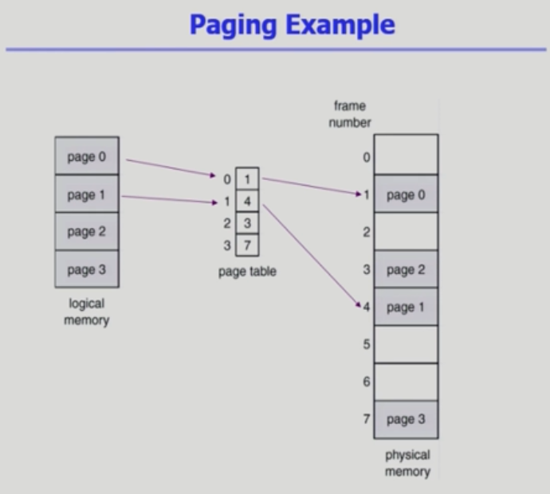
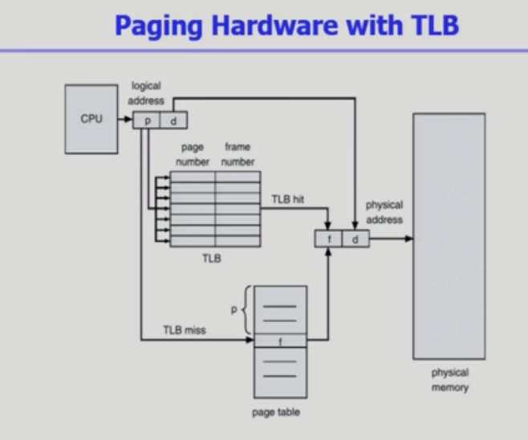
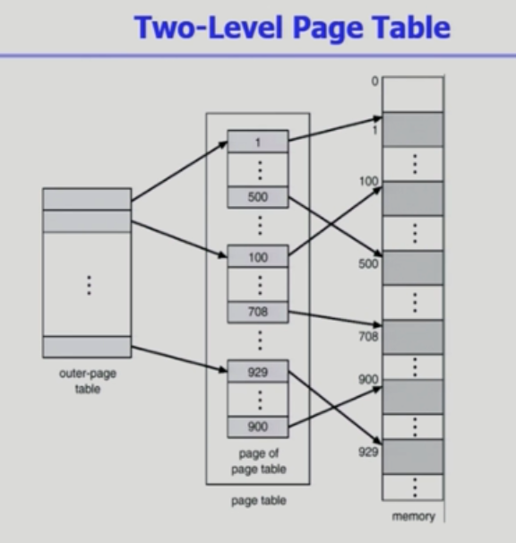
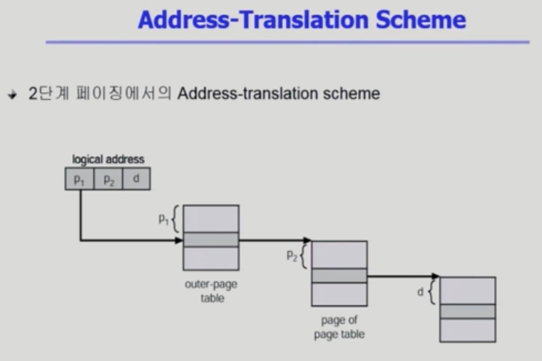
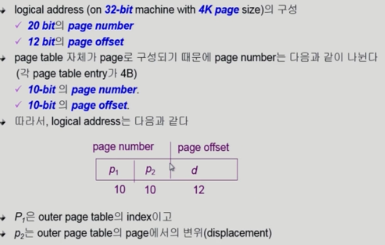

## 물리적인 메모리 관리

> 이전 분할 방식의 경우 고정 분할 방식이든 가변 분할 방식이든 사용하지 않는 빈 공간은 조각으로 남는다.
>
> Paging은 외부조각은 발생하지 않지만 내부조각이 발생할 수 있다.
>
> 외부조각: 애초에 할당되지 않은 메모리 공간
>
> 내부조각: 할당되었지만 사용하지 않는 메모리 공간
>
> TLB는 핵심적인 역할을 한다

​        

### Paging

* Process의 virtual memory를 동일한 사이즈의 page 단위로 나눔
* Virtual memory의 내용이 page 단위로 noncontiguous 하게 저장됨
* 일부는 backing storage에, 일부는 physical memory에 저장

### Basic Method

* Physical memory를 동일한 크기의 frame으로 나눔
* Logical memory를 동일 크기의 page로 나눔 (frame과 같은 크기)
* 모든 가용 frame들을 관리
* page table을 사용하여 logical address를 physical address로 변환
* External fragmentation 발생 안함
* Internal fragmentation 발생 가능

​           

### MMU 논리적 공간의 표현 경우의 수 = Dynamic Relocation

> 1비트일 때 2개의 공간을 표현 가능하다 (2^1번째까지)
>
> 2비트일 때는 4개(2^2번째까지)... N비트일 때는 2의 N승 번째까지 공간을 표현 가능하다
>
> 32비트 주소체계를 쓴다면 2의 32승의 표현을 할 수 있고 한 공간의 크기를 1바이트라고 할 때 약 4GB의 크기이다.
>
> 이 때의 페이지의 개수를 대략 구한다면 4K로 나누면 백만개가 나올 수 있다. = 페이지 테이블의 크기 약 100만개 엔트리 필요

* Page table = main memory에 상주 = 수 많은 연산을 위함
  * 모든 메모리 접근 연산에는 2번의 memory access 필요 : **주소 확인** 후 **실제 물리적 공간으로 접근**
    * Page table 접근 1번, 실제 data/instruction 접근 1번 ( page table이 상주하기 때문에 )
    * 속도 향상을 위해 associative register(TLB의 한 종류 **병렬적으로 탐색 가능**하도록 만들어짐) 혹은 translation look-aside buffer(**TLB**: 주소변환이 빠름)라 불리는 고속의 lookup hardware cache(미리 어느정도의 정보를 담아둠) 사용
      * 이 때문에 page table에 접근하기 전에 TLB부터 탐색후 메모리 접근 = 메모리 1번접근 = 더 빠름
      * TLB의 경우 cache 즉 임시 번호기 때문에 일일히 수동으로 찾아내야함 = 오버헤드가 큼
        * 프로세스의 context switch가 발생하면 flush (remove old entries) = 오버헤드가 큼
      * Page table은 내용이 fix기 때문에 한 번에 거리 계산해서 이동
* Page-table base register(PTBR)가 page table을 가리킴
* Page-table length register(PTLR)가 테이블 크기 보관

​         

### Effective Access Time(EAT)

TLB를 통해서 주소변환이 일어나는 비율 = a (Hit ratio)

TLB 검색에서 실패한 경우 = 1 - a (TLB Miss, Miss ratio)

TLB에 접근하는 시간 = 입실론 = b

메모리 접근하는 시간 = 1

​       

* EAT = (1+b)a + (2+b)(1-a) = 2 + b - a [ 성공하는 경우와 실패하는 경우의 효율 계산 ]
* TLB의 hit ratio가 1에 가까워질수록 매우 효과가 있다 (약 2배)

​        

## Two-Love Page Table

* page table자체를 page로 구성한다 = 페이지를 두 단계로 나눈다 = 메모리를 두 번 거친다
* 가상 메모리의 페이지의 중간 부분은 실사용이 잘 일어나지 않는다 = 페이지 테이블에 계속 정보는 저장된다
  * 2단계 페이지에서는 사용이 안되는 부분 = NULL 로 남겨서 메모리상 오버헤드를 줄인다

> 현대의 컴퓨터는 address space가 매우 큰 프로그램을 지원한다.
>
> 32 비트 = 4GB = 각 페이지의 크기 4K = 1M개의 page table entry 필요 = 각 page entry가 4B(비트)시 프로세스당 4M의 page table 필요 = 대부분 프로그램은 4G의 주소 공간 중 극히 일부분만 사용하므로 page table 공간 낭비 = 메모리에 탑재
>
> 사용되지 않는 주소 공간에 대한 outer page table의 엔트리 값을 NULL(대응하는 inner page table이 없음)

### 주소변환의 과정

p1 : 바깥쪽 페이지 구분을 위해 저장한 번호 (전체 32비트(4GB분량) - 12(d) - 10(p2)  )

* p2의 시작 번호를 가짐
* NULL이면 검색 중단

p2 : 안쪽 페이지 구분을 위해 저장한 번호 (1K 개 = 10비트 필요, 엔트리 하나당 4B)

* p2 = 시작부분부터 얼마나 떨어져있는지 나타냄
* p2만큼 떨어진 곳에 도달해서 메모리 상의 시작 위치를 얻어냄

d : 그 페이지에서 얼만큼 떨어져 있는지 구분하는 크기 d(최대 1Kx4 = 4K = 12비트)

* 메모리상 시작 위치로부터 d만큼 떨어진 곳에 도달

​       

## Multilevel Paging and Performance

* 물리적 주소로 변환하기 위해 더 많은 메모리 접근이 필요하다

  * TLB를 통해 메모리 접근 시간을 줄일 수 있다

* 4단계 페이지 테이블을 사용하는 경우

  * 메모리 접근 시간이 100ns, TLB 접근 시간이 20ns이고
  * TLB hit ratio가 98%인 경우
    * ema = 0.98x120 + 0.02x520 = 128nanoseconds
    * 주소변환만 위해 28ns만 소요 (128-100)
    * 즉 4단계로 paging해도 효율이 엄청 떨어지는 것은 아니다

  ​    

  ​     

## 비트를 활용해 page가 현재 메모리를 사용하는지 체크 

## Page Fault

* Swap 디스크에 있는 경우 그 공간의 메모리는 비어있다(I/O 작업)
* invalid page 를 접근하면 MMU가 트랩을 발동 시킴 (page fault trap)
  * Kernel mode로 들어가서 page fault handler가 invoke됨

​      

## Page replacement

> 메모리가 꽉차있다면 하나를 쫓아내야 한다
>
> 곧바로 사용되지 않을 page를 쫓아내는 것이 좋다
>
> 동일한 페이지가 여러 번 쫓겨났다가 다시 들어올 수 있다

### LRU

* 페이지를 줄세우기 : 위쪽(이전) - 아래쪽(최근) = 위쪽을 먼저 쫓아낸다
  * O(1) complexity
* 재사용시 맨 아래로 가져온다

​     

### LFU

* 최소 heap의 자료구조를 사용
* 아래로 내려갈수록 많이 사용된 페이지(하위노드)
  * O(log n) complexity

​     

### 다양한 캐싱 환경

* 캐싱 기법
  * 한정된 빠른 공간(캐쉬)에 요청된 데이터를 저장해두었다가 후속 요청시 캐쉬로부터 직접 서비스하는 방식
  * paging system(느린 영역=swap디스크) 외에도 cache memory, buffer caching(느린 영역=디스크의 파일 시스템, 한정된 파일 공간에서 재사용요청시 전송), Web caching(지리적으로 떨어진 전송 시간차를 줄임) 등 다양한 분야에서 사용
* 캐시 운영의 시간 제약
  * 교체 알고리즘에서 삭제할 항목을 결정하는 일에 지나치게 많은 시간이 걸리는 경우 실제 시스템에서 사용할 수 없음
  * Buffer caching 이나 **Web caching의 경우**
    * O(1)에서 O(log n) 정도까지 허용
  * Paging system인 경우
    * Page fault인 경우에만 OS가 관여함
    * 페이지가 이미 메모리에 존재하는 경우 참조시각 등의 정보를 OS가 알 수 없음
    * O(1)인 LRU의 list조작조차 불가능

​         

