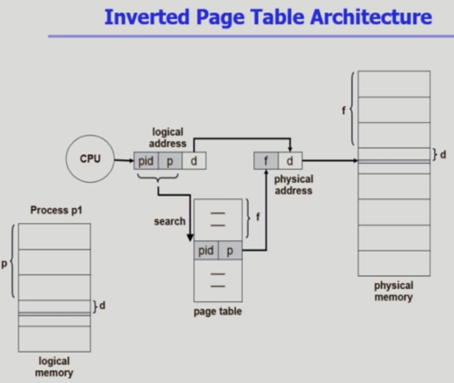
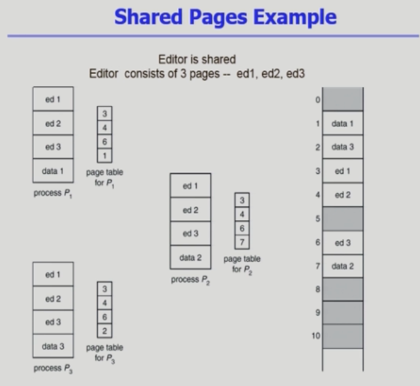
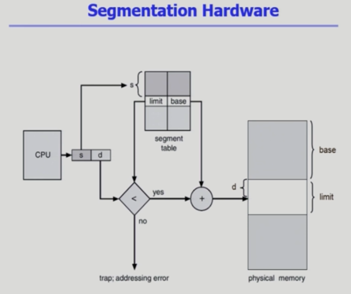
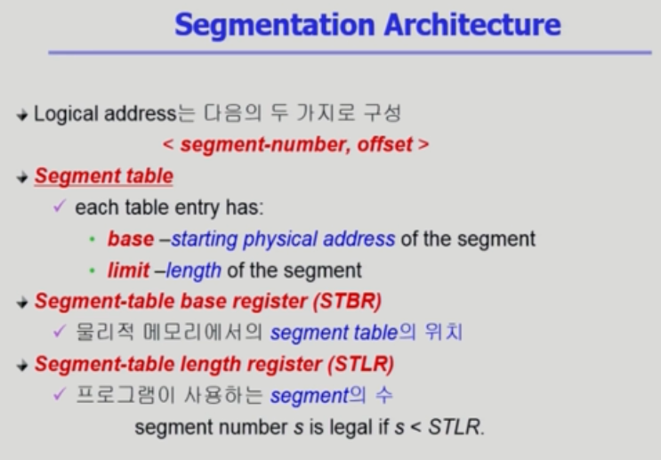
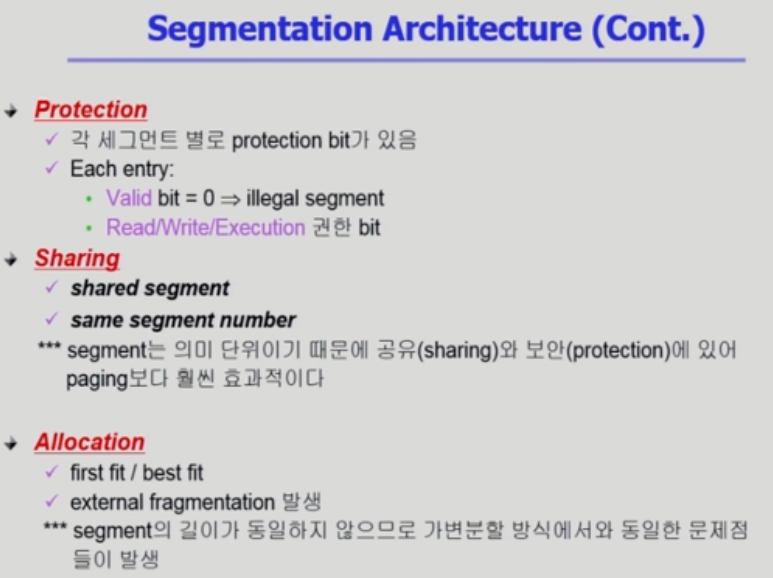
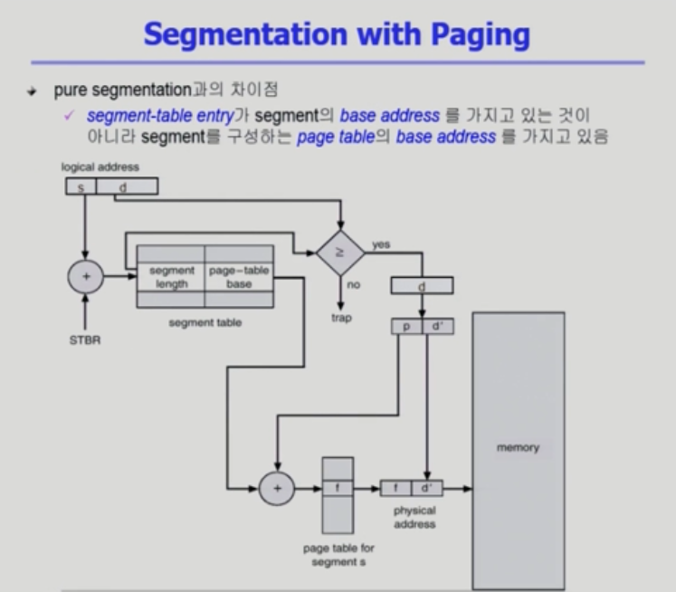

# 메모리 관리3

> 메모리관리의 가장 중요한 부분은 논리적인 주소를 물리적인 주소로 변환하는 과정
>
> 이 변환과정에서 어떻게 할당되느냐에 따라 메모리 공간의 낭비가 결정된다.
>
> 통째로 배분하는 경우 외부조각, 내부조각이 생길 수 있기 때문이다.

​        

## Inverted Page table

* 역방향 페이지 테이블

* 원래 논리 주소 - 물리 주소로 변환해서 이동하지만 공간낭비가 매우 심하다
* Inverted : 페이지 테이블에 물리적인 메모리 순번이 기록되어있음
  * 하지만 이를 찾기 위해 페이지 테이블 엔트리 모두 탐색해야함 = 오버헤드 매우 큼
  * 병렬적인 검색이 가능하다면 효율이 높아짐(associate register = expensive)

​          

​       

## Shared Pages Example

* **Shared Page (Re-entrant Code = Pure code)의 조건**
  * 어차피 똑같은 코드를 사용하므로 **read-only**해서 하나의 code만 메모리에 올림
    * Ex) text editors, compilers, window systems
  * Shared code는 **모든 프로세스의 logical address space에서 동일한 위치**에 있어야 함
* Private code and data
  * 각 프로세스들은 독자적으로 메모리에 올림
  * Private data는 logical address space의 아무 곳에 와도 무방

​       

​          

​              

# Segmentation

> 페이징 기법 물리적인 공간 크기자체가 동일했는데 Segmentation은 의미 단위로 주소 공간을 자른다 = segment
>
> 일반적으로는 code, data, stack
>
> logical unit(함수) : main(), function, global variables, stack, symbol table, arrays

* 세그먼트 테이블 : Segment의 시작위치와 메모리상 위치뿐 아니라 **segment의 길이** 정보도 포함한다

  * limt : 세그먼트의 길이가 저장되는 곳

  * STLR : 프로그램이 사용하는 세그먼트의 수로 그보다 더 많은 프로세스 공간을 요청하거나 더 긴 길이의 공간을 요청하 trap을 발생

  * Sharing code 기법을 활용한다.

    ​        

  #### Paging과 비교되는 단점

  * 길이가 균일하지 않기 때문에 바이트 단위 주소를 가리켜 물리적인 공간을 배분한다.

    * 내부조각, 외부조각 문제가 생긴다

    * 어느 조각에 넣어야하는가에 대한 문제가 또 발생한다 : 외부조각의 문제

      

    * first-fit/best-fit

#### 	Paging과 비교되는 장점

* 의미 단위로 쪼개기 때문에 코드로 짤라지는 Paging의 문제를 고려하지 않아도 됨
* Paging 기법은 굳이 쪼개도 되지 않는 부분을 잘게 쪼개서 사용했으나 의미단위로 자르면 code, data, stack 처럼 양이 훨씬 적어짐
* 뛰어난 장점에도 불구하고 **pure 한 segmentation 기법은 실제로 사용되지 않음**

​                

​                 

## Segmentation with Paging

> 두 방식을 혼합해 사용한다

* **segment table** 사용 : 세그먼트로 자르는 것은 동일하나 그 세그먼트들이 여러 개의 페이지로 나뉘어 이동
  * 대신 페이지의 크기를 여러개 사용
    * Ex) 1번 세그먼트는 페이지를 3개 사용, 2번은 4개 등등