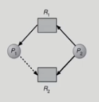

# DeadLock

**Claim edge** : 프로세스가 미래에 자원을 요청할 수 있음(점선)

**Request Edge** : 해당 자원을 실제로 요청시(실선)

사이클 조사 시간: 프로세스가 n개일 때 O(n^2)

​           

데드락이 발생할 가능성이 있는 경우 : unsafe state

데드락이 발생할 가능성이 없는 경우 : safe state

​            

​            

## [ 데드락 파악 방법 ]

​                 

## Banker's Algorithm

> 테이블을 통해 각 프로세스의 자원 현황을 살펴본다

* **비록 자원이 남더라도** 현재 자원 상황을 고려하여 프로세스가 요청할 수 있는 최대 자원을 넘지 못한다면 주지 않는다.
  * 항상 safe한 상태를 유지하고 필요한 자원을 주입한 다음 프로세스가 동작을 완료하면 원래 가지고 있던 자원도 같이 회수
  * 그렇게 회수한 것까지 고려해 다음 프로세스에게도 자원을 공급할 수 있다.

​              

## Deadlock Detection and Recovery

* Request : 현재 시각 프로세스가 실제로 요청한 자원량
*  Request가 없는 프로세스는 미래에 자원을 내어 놓을 것으로 가정
* 이 가정을 바탕으로 데드락이 있을 것인지 없을 것인지 판단

​                

### Deadlock Recovery

* **Process termination**
  * 데드락에 연루된 프로세스들을 종료(abort)하는 방식
  * 전체를 한꺼번에 종료
  * 데드락이 풀어질 때까지 하나씩 종료해나감
* **Resource Preemption**
  * 비용을 최소화할 victim 선정
  * Safe state로 roll back하여 process를 restart
  * Starvation 문제
    * 동일한 프로세스가 계속해서 victim으로 선정되는 경우
    * cost factor에 rollback 횟수도 같이 고려

​              

​                 

## Deadlock Ignorance

* 데드락이 일어나지 않는다고 가정해 아무런 조치도 취하지 않는 방법
* 데드락은 매우 드물게 발생하므로 조치하는 것 자체가 더 큰 overhead일 수 있다.
* 시스템에 데드락이 발생하면 사용자가 직접 process 종료
* UNIX, Windows 등 대부분 범용 OS가 채택