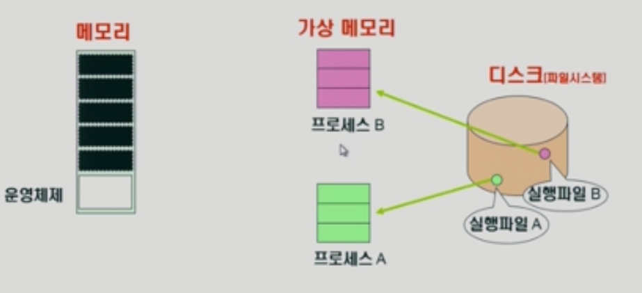
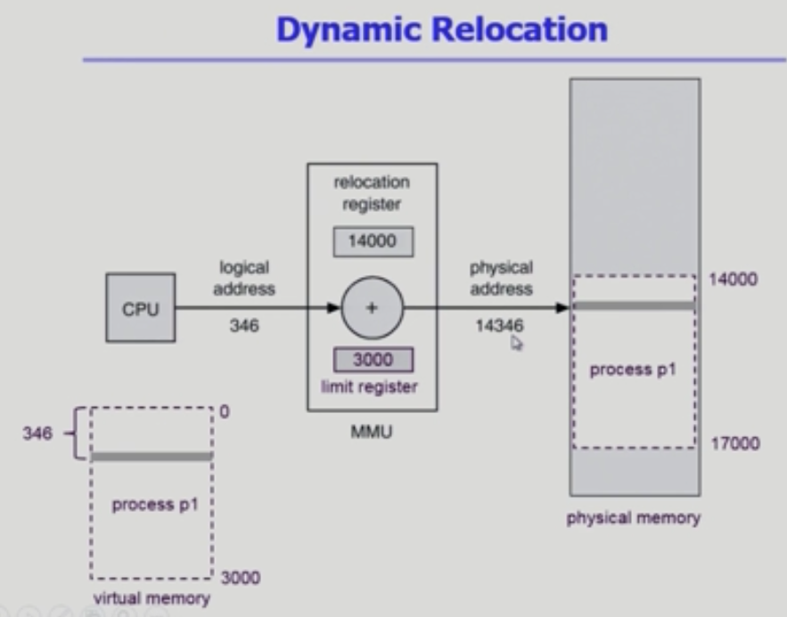

# 메모리 관리1

> 메모리는 주소를 통해서 접근하는 장치

​        

## 주소의 종류

### Logical address(=virtual address, 가상메모리)

* 프로세스마다 독집적으로 가지는 주소 공간

* 각 프로세스마다 0번지부터 시작

* CPU가 보는 주소는 logical address

  ​       

### Physical address

* 실제로 메모리에 올라가는 위치

​      

### 주소 바인딩

> 논리적인 주소와 메모리에 실제 올라가는 위치가 다르기 때문에 주소 변환과정이 필요하다

**Symbolic Address[프로그래머의 시선] - Logical Address - Physical address[메모리에 올라갈 때]**

​      

​          

## 주소 바인딩(Address Binding)

> **운영체제가 아니라 하드웨어가 해준다**

* compile time binding (absolute code)
  * 컴파일할 때 이미 물리적인 주소가 매겨지는 방법
* Load time binding (relocatable code)
  * 프로그램이 시작될 때 주소가 생기고 변하지 않음
* Run time binding(Execution time binding), (address mapping table)
  * 수행이 시작된 이후에도 프로세스 메모리 상 위치를 옮길 수 있음
  * 하드웨어적 지원이 필요
  * CPU는 논리적인 주소를 보기 때문에 물리적인 주소로 해석하는 과정이 필요(binding 점검)

​       

### MMU (Memory Management Unit)

* logical address를 physical address로 매핑해주는 하드웨어 디바이스
* MMU는 물리적 메모리의 시작위치를 가지고 있으며 가상 공간의 크기를 계산해 접근 공간의 범위를 한정해준다.
* 만약 해당 프로세스의 가상 메모리 영역을 침범하는 접근이 발견되면 소프트웨어 인터럽트(트랩)가 발생

​              

​               

## Some Terminologies

> Loading : 메모리에 올리는 것

​             

### Dynamic Loading

* 프로세스 전체를 메모리에 미리 다 올리는 것이 아니라 해당 루틴이 불려질 때 메모리에 load 하는 것
* memory utilization 향상
* 운영체제의 특별한 지원없이 프로그램 자체에서 구현 가능 (현대에서는 OS가 해줌)

​       

### Overlays

* 메모리에 프로세스 부분 중 실제 필요한 정보만 올림
* 프로세스의 크기가 메모리보다 클 때 유용
* 프로그래머가 구현하고 코드가 복잡함

​         

### Swapping : Load time binding 보다는 Runtime Binding이 효율적

* 프로세스를 통째로, 일시적으로 메모리에서 backing store(swap area, 디스크)로 쫓아내는 것
* Swapping은 데이터를 전송하는 시간이 대부분을 차지한다(통째로 옮기기 때문에).
  * 원래 디스크는 읽는 시간에 대부분을 할애
* **Swap in / Swap out**
  * 중기 스케줄러(swapper)에 의해 swap out시킬 프로세스 선정
  * priority-based CPU scheduling algorithm
    * 우선순위가 낮은 프로세스를 swap out 시킴
    * 우선순위가 높은 프로세스를 메모리에 올려놓음

​             

### Dynamic Linking

* Linking을 실행 시간(execution time)까지 미루는 기법

* **Static linking** (static library)
  * 프로그램 안에 이미 라이브러리 파일이 포함되어있음
  * 그러므로 파일의 크기가 큼
  * 동일한 라이브러리 파일을 각각의 프로세스에 올릴 때 메모리 낭비
* **Dynamic linking** (shared library)
  * 라이브러리가 실행시 연결(link)  됨
  * stub : 라이브러리 호출 부분에 라이브러리 루틴의 위치를 찾기 위한 작은 코드
  * 라이브러리가 이미 메모리에 있으면 그 루틴의 주소로 이동, 없으면 디스크에서 읽어옴
  * 운영체제의 도움이 필요

​             

​         

### Contiguous Allocation (연속 할당)

* ### 고정분할 방식

  * 운영체제가 미리 크기별로 분할해놓고 그 분할의 크기보다 작아야 프로세스에게 공간 부여
    * 분할 조각보다 큰 프로세스가 많다면 공간 낭비가 심해짐(외부조각)
    * 또한 분할보다 작더라도 남는 공간이 발생해서 공간 낭비 발생(내부조각)

* ### 가변 분할 방식

  * 메모리가 분할되어있지 않아서 자율 배분이 가능하지만 다른 프로그램들이 뒤이어서 계속 들어오기 때문에 나갈 때 공간의 크기가 기다리고 있는 프로세스 크기와 맞지 않으면 계속 낭비가 발생(외부조각)
  * 내부조각은 생기지 않는다

  ​    

  ​    

### Hole

* 가용 메모리 공간/조각
* 다양한 크기의 Hole (메모리 조각)들이 여러 곳에 흩어져 있음
* 프로세스가 도착하면 수용가능한 hole을 할당
* 운영체제는 다음의 정보를 유지
  * 1) 할당공간
    2) 가용공간(hole)

​      

### Dynamic Storage-Allcation Problem

> 가변 분할 방식에서 size n인 요청을 만족하는 가장 적절한 hole 찾기

* First-fit
  * Size가 n 이상인 것 중 최초로 찾아지는 hole에 할당
* Best-fit
  * Size가 n 이상인 가장 작은 hole을 찾아서 할당
  * hole이 크기 순이 아닌 경우 모든 hole의 리스트 탐색
* Worst-fit
  * 가장 큰 hole에 할당

> 효율 : Best-fit,First-fit > Worst-fit

#### compaction

* external fragmentation 문제를 해결
* 사용 중인 메모리 영역과 hole들을 한곳으로 몰아 큰 block 생성
* 비용이 많이 드는 방법
* 최소한의 이동으로 compaction하는 방법
* Runtime-binding에서만 사용가능