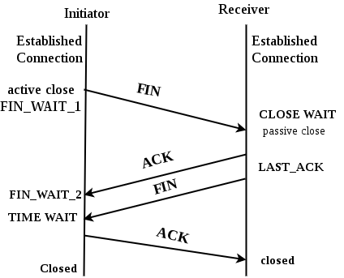

# Network 

## [TCP] 3 way handshake & 4 way handshake (다같이)

​                   

### TCP 3-way HandShake

> TCP/IP 프로토콜을 이용해 통신을 하는 응용프로그램이 데이터를 전송하기 전 정확한 전송을 보장하기 위해 상대방 컴퓨터와 세션을 수립하는 과정
>
> ```
> Client > Server : TCP SYN
> 
> Server > Client : TCP SYN ACK
> 
> Client > Server : TCP ACK
> ```


​                   

#### - TCP의 3-way Handshaking 과정

**[STEP 1]**

클라이언트는 서버에 접속을 요청하는 **SYN 패킷**을 보낸다.

이때 클라이언트는 SYN을 보내고 SYN/ACK 응답을 기다리는 SYN_SENT **상태**가 되는 것이다.

 

**[STEP 2]** 

서버는 SYN요청을 받고 A클라이언트에게 요청을 수락한다는 **ACK와 SYN flag 가 설정된 패킷을 발송**하고,

클라이언트가 다시 ACK으로 응답하기를 기다린다. 이때 B서버는 **SYN_RECEIVED 상태**가 된다.

 

**[STEP 3]**

클라이언트는 서버에게 **ACK**을 보내고, 이후부터는 연결이 이루어지고 실제 데이터가 오가게 되는 것이다.

이때의 서버 상태가 ESTABLISHED이다.

**위와 같은 방식으로 통신하는 것이 신뢰성 있는 연결을 맺어 준다는 TCP의 3 Way handshake 방식**이다.

​                 

### TCP 4-way HandShake

> TCP/IP 프로토콜을 이용해 통신을 하는 응용프로그램이 데이터를 전송하기 전 정확한 전송을 보장하기 위해 상대방 컴퓨터와 세션을 수립하는 과정
>
> ```
> Client > Server : TCP FIN
> 
> Server > Client : TCP ACK, FIN(FIN을 보내기 전 data를 보낼 수 있다)
> 
> Client > Server : TCP ACK(마지막 ACK를 보내고 평소 2배이상 time out 시간을 설정)
> ```



1. 클라이언트는 서버에게 연결을 종료한다는 FIN 플래그를 보낸다.
2. 서버는 FIN을 받고, 확인했다는 ACK를 클라이언트에게 보낸다. (이때 모든 데이터를 보내기 위해 CLOSE_WAIT 상태가 된다)
3. 데이터를 모두 보냈다면, 연결이 종료되었다는 FIN 플래그를 클라이언트에게 보낸다.
4. 클라이언트는 FIN을 받고, 확인했다는 ACK를 서버에게 보낸다. (아직 서버로부터 받지 못한 데이터가 있을 수 있으므로 TIME_WAIT을 통해 기다린다.)

- 서버는 ACK를 받은 이후 소켓을 닫는다 (Closed)
- TIME_WAIT 시간이 끝나면 클라이언트도 닫는다 (Closed)


이렇게 4번의 통신이 완료되면 연결이 해제된다.

​                   


## TCP/IP (흐름제어/혼잡제어) (요셉)

> 흐름제어: Host to Host
> 혼잡제어: Host & Router
>
> 해결책 1은 보통 문제가 있는 방식으로 해결책 2를 위주로 공부한다.

​                     

### 1. 흐름제어(Flow Control)

> 송신 측(sender)와 수신 측(receiver)에서는 데이터를 그냥 받는게 아니라 **버퍼를 이용**해 보내고 받는다.
>
> * 데이터를 보내기 전: 버퍼에 하나씩 쌓아두고 순서대로 보낸다
> * 데이터를 받는 곳: 버퍼를 통해 차례차례 받아준다.
>
> **rwnd(receiver window)**: 데이터를 받는 쪽에서 **남은 버퍼의 공간**을 알려준다.(wnd = window)

​                 

#### - 문제점

* 수신 측의 데이터 처리 속도가 송신 측의 데이터 처리보다 빠르면 상관 없지만 송신측의 속도가 빠를 경우 문제가 생긴다.
  * 버퍼의 크기보다 쌓인 데이터가 많아질 경우 데이터 유실이 발생

​                

#### - 해결책 1: Stop and Wait

* 한 패킷마다 확인 응답을 받아야 그 다음 패킷을 전송하는 방법

  

​                 

#### 해결책 2: Sliding Window(Go Back N ARQ)

* 수신 측의 윈도우 크기를 기준으로 송신측의 윈도우 크기를 맞춘다.
* 윈도우 내부에 있는 세그먼트들을 자유롭게 보내기 시작한다.
  * 보내는 동안 윈도우의 크기는 점점 작아진다.
* Receiver 측에서 현재까지 받은 데이터 번호 + 1 을 ACK로 보내준다
* Sender 측에서 다시 윈도우의 크기를 원상복구하고 시작 위치를 (받은 데이터 번호 + 1) 로 재설정한다.


### 2. 혼잡제어(Congestion Control)                 

> 송신 측의 데이터 전달과 네트워크의 데이터 처리 속도 차이를 해결하기 위한 기법
>
> Host vs Network(Router): 좀 더 넓은 관점에서의 전송 문제이다.
>
> * 만약 한 라우터에 데이터가 몰릴 경우 라우터는 자신의 데이터를 모두 처리할 수 없게 되고 호스트들은 또 다시 재전송하는 것을 반복해 악순환이 계속된다.


​               

#### 해결책 1: AIMD(Additive Increase / Multiplicative Decrease)

* 패킷을 하나씩 보내고 잘 도착하면 window의 크기를 하나씩 증가시켜 전송한다.
* 만약 전송에 실패한다면 패킷의 속도를 절반으로 줄인다.
* 오랜 시간이 걸리고 네트워크가 혼잡해지는 상황을 미리 감지하지 못한다.

​               

#### 해결책 2: Slow Start / Fast Retransmit / Fast Recovery

​                

#### 1) Slow Start (느린 시작)

* AIMD와의 공통점: 패킷을 보내고 ACK를 받아 다음 윈도우 크기에 해당하는 패킷을 보낸다.
* AIMD와의 차이점: 윈도우 사이즈가 이전 크기의 두 배가 된다.
* **ssthresh(Slow Start threshold)**: 이 값에 도달하면 더 이상 2배 증가하지 않고 1씩 선형 증가한다. 

​           

#### 2) Fast Retransmit (빠른 재전송)

* 수신 측(라우터)에서 원래 받아야할 패킷이 아닌 그 다음 패킷이 도착한 경우에도 ACK 패킷을 보낸다.
  * 이 때 잘 도착한 패킷의 다음 패킷을 보내므로 불완전한 현재 패킷이 아닌 잘 처리된 이전 패킷 번호+1을 다시 보낸다.
  * **duplicate ACKs** 중복된 패킷을 3번 받으면 재전송을 진행한다. 이 때 window size가 감소한다.
    * 즉 2번의 기회를 주는 것이다(중복 3번 = loss 2번).
* **time out**: 시간이 지나도 ACK가 없을 때는 모든 패킷들이 loss 되었음을 의미하므로 cwnd를 1로, ssthresh를 절반으로 줄인다.

|                | TCP Tahoe                       | TCP Reno                        |
| -------------- | ------------------------------- | ------------------------------- |
| 방식           | Duplicate ACKs와 time out 구분X | Duplicate ACKs와 time out 구분O |
| Duplicate ACKs | cwnd = 1, ssthresh/2            | cwnd/2                          |
| time out       | cwnd = 1, ssthresh/2            | cwnd = 1, ssthresh/2            |

​              

#### 3) Fast Recovery (빠른 회복)

* 혼잡한 상태가 되면 window size를 1이 아닌 절반으로 줄이고 선형 증가시키는 방법이다.
  * 즉, 혼잡상황 이후 순수 AIMD 방식으로 동작한다.

​                        

## 프로토콜 (요셉)

> 서로 다른 기기들 간의 데이터 교환을 원활하게 수행할 수 있도록 표준화시켜놓은 통신 규약

### 이메일을 보낼 수 있는 이유?

* SMTP(Simple Mail Transfer Protocol)라는 프로토콜이 규정되어있고 전 세계 메일 서버가 이를 따르기 때문이다.

  ​                  

* 이 외 대표적인 프로토콜들

  * HTTP / HTTPS / IPFS
  * TCP/IP

   

​                  

## 대칭키 & 공개키 (다같이)

> ### **대칭키란, 장단점**
>
> 대칭키는 위에서 설명한대로 암복호화키가 동일하며 해당 키를 아는 사람만이 문서를 복호화해 볼 수 있게된다. 대표적인 알고리즘으로는 DES, 3DES, AES, SEED, ARIA 등이 있다.  
>
> 공개키 암호화 방식에 비해 **속도가 빠르다는 장점**이 있지만, **키를 교환해야한다는 문제 (키 배송 문제)**가 발생한다. 키를 교환하는 중 키가 탈취될 수 있는 문제도 있고 사람이 증가할수록 전부 따로따로 키교환을 해야하기 때문에 관리해야 할 키가 방대하게 많아진다. 
>
> 이러한 키 배송 문제를 해결하기 위한 방법으로 키의 사전 공유에 의한 해결, 키 배포센터에 의한 해결, Diffie-Hellman 키 교환에 의한 해결, 공개키 암호에 의한 해결이 있다. 
>
> 대칭키 암호화 방식: 암복호화키가 동일한 암호화 방식
>
> 대표 알고리즘 : DES, 3DES, AES, SEED, ARIA 등
>
> 장점 : 수행 시간이 짧음
>
> 단점 : 안전한 키교환 방식이 요구됨, 사람이 증가할수록 키관리가 어려워짐
>
> ​                            
>
> ### **공개키, 장단점**
>
> 위에서 설명한 대칭키의 키교환 문제를 해결하기 위해 등장한 것이 공개키(비대칭키) 암호화 방식이다. 이름 그대로 키가 공개되어있기 때문에 키를 교환할 필요가 없어지며 **공개키**는 모든 사람이 접근 가능한 키이고 **개인키**는 각 사용자만이 가지고 있는 키이다.
>
> 예를 들어, A가 B에게 데이터를 보낸다고 할 때, **A는 B의 공개키로 암호화한 데이터**를 보내고 **B는 본인의 개인키로 해당 암호화된 데이터를 복호화**해서 보기 때문에 암호화된 데이터는 B의 공개키에 대응되는 개인키를 갖고 있는 B만이 볼 수 있게 되는 것이다. 

​                     

##  TLS/SSL HandShake (다같이)


### 진행 순서

1. 클라이언트는 서버에게 `client hello` 메시지를 담아 서버로 보낸다. 이때 암호화된 정보를 함께 담는데, `버전`, `암호 알고리즘`, `압축 방식` 등을 담는다.
2. 서버는 클라이언트가 보낸 암호 알고리즘과 압축 방식을 받고, `세션 ID`와 `CA 공개 인증서`를 `server hello` 메시지와 함께 담아 응답한다. 이 CA 인증서에는 앞으로 통신 이후 사용할 대칭키가 생성되기 전, 클라이언트에서 handshake 과정 속 암호화에 사용할 공개키를 담고 있다.
3. 클라이언트 측은 서버에서 보낸 CA 인증서에 대해 유효한 지 CA 목록에서 확인하는 과정을 진행한다.
4. CA 인증서에 대한 신뢰성이 확보되었다면, 클라이언트는 난수 바이트를 생성하여 서버의 공개키로 암호화한다. 이 난수 바이트는 대칭키를 정하는데 사용이 되고, 앞으로 서로 메시지를 통신할 때 암호화하는데 사용된다.
5. 만약 2번 단계에서 서버가 클라이언트 인증서를 함께 요구했다면, 클라이언트의 인증서와 클라이언트의 개인키로 암호화된 임의의 바이트 문자열을 함께 보내준다.
6. 서버는 클라이언트의 인증서를 확인 후, 난수 바이트를 자신의 개인키로 복호화 후 대칭 마스터 키 생성에 활용한다.
7. 클라이언트는 handshake 과정이 완료되었다는 `finished` 메시지를 서버에 보내면서, 지금까지 보낸 교환 내역들을 해싱 후 그 값을 대칭키로 암호화하여 같이 담아 보내준다.
8. 서버도 동일하게 교환 내용들을 해싱한 뒤 클라이언트에서 보내준 값과 일치하는 지 확인한다. 일치하면 서버도 마찬가지로 `finished` 메시지를 이번에 만든 대칭키로 암호화하여 보낸다.
9. 클라이언트는 해당 메시지를 대칭키로 복호화하여 서로 통신이 가능한 신뢰받은 사용자란 걸 인지하고, 앞으로 클라이언트와 서버는 해당 대칭키로 데이터를 주고받을 수 있게 된다.

​                   

## SSL/TSL 과 HTTPS

```
SSL/TSL
공통점: 전송계층 상에서 클라이언트,서버에 대한 인증 및 데이터 암호화 수행
     - 클라이언트와 서버 양단 간 응용계층 및 TCP 전송계층 사이에서,
     - 안전한 보안 채널을 형성해 주는 역할을 하는, 보안용 프로토콜
차이점: SSL v3.0 을 참고로하여 RFC 2246(1999년)으로 표준화된 것이 TLS 임
```

HTTPS: TSL에 HTTP 프로토콜을 얹어서 사용

​                 

## HTTP & HTTPS (요셉)

​               

### 1. HTTP

>애플리케이션 계층의 프로토콜이며 TCP 혹은 TLS로 전송된다.
>http:// 를 통해 이 프로토콜을 사용해 정보를 교환하겠다고 선언한다.
>80 포트번호를 사용한다.
>텍스트, 이미지, 영상, JSON 등 거의 모든 형태의 데이터를 전송 가능

​                  

#### 1. 클라이언트-서버 프로토콜

* 요청(Request)과 응답(Response)로 구성되어있다.
* 클라이언트와 서버가 HTTP 메시지를 주고 받으며 통신한다.

​               

#### 2. 구성

* HTTP 요청 메시지: GET, POST, PUT, HEAD, CONNECT, LINK, UNLINK

  * HEAD: 이 메시지에 대한 응답은 본문을 가져서는 안되며, 본문이 존재해도 무시한다.

* HTTP 응답 메시지: 1xx, 2xx, 3xx, 4xx, 5xx 등

  | 응답 메시지        | 설명                                                  | 주요 메시지 |
  | ------------------ | ----------------------------------------------------- | ----------- |
  | 1xx(Informational) | 요청을 받았으며 프로세스를 계속 진행합니다.           |             |
  | 2xx(Success)       | 요청을 성공적으로 받았으며 인식했고 수용하였습니다.   | 200         |
  | 3xx(Redirection)   | 요청 완료를 위해 추가 작업 조치가 필요합니다.         |             |
  | 4xx(Client Error)  | 요청의 문법이 잘못되었거나 요청을 처리할 수 없습니다. | 404, 405    |
  | 5xx(Server Error)  | 서버가 명백히 유효한 요청에 대한 충족을 실패했습니다. | 503(준비X)  |

​           

#### 3. 비연결성 프로토콜

* 종단간 연결 없음: Connectionless
* 이전 상태를 유지하지 않음: **Stateless**

​               

### 2. HTTPS

> HTTP는 전송계층 TCP위에서 동작하는데 별다른 보안 조치가 없다.
> HTTPS 는 **SSL(Secure Sockets Layer)** 라는 보안계층 위에 HTTP를 얹어서 보안을 보장한다.
> 이 방식을 SSL 암호화 통신이라고 한다.
> 443번 포트를 사용한다
>
> **HTTPS**는 대칭키 암호화 방식과 비대칭키 암호화 방식을 둘 다 사용한다.


#### 1) 대칭키 암호화

* 클라이언와 서버가 동일한 키를 사용해 암호화/복호화 진행
* 키가 노출되면 매우 위험하지만 연산 속도가 빠름

​                 

#### 2) 비대칭키 암호화

* 1개의 쌍으로 구성된 공개키와 개인키를 암호화/복호화 하는데 사용
* 키가 노출되어도 비교적 안전하지만 연산속도가 느림

​                   

#### [ 동작 과정 ] 

1. 클라이언트가 서버에 연결을 시도
2. 서버는 공개키(public key)를 브라우저(클라이언트)에게 넘겨줌
3. 브라우저(클라이언트)는 공개키의 유효성 검사를 진행하고 세션키 발급
4. 서버에서 받은 공개키로 암호화한 뒤 서버로 암호화된 세션키를 보내줌
5. 서버는 개인키로 암호화된 세션키를 복호화해 세션키를 얻어낸다.
6. 이로써 양쪽 모두에게 세션키가 배분되며 세션키(대칭키)를 이용해 HTTP를 암호화한다.


​                         

## WEB (요셉)

WEB은 World Wide Web의 약자로 **인터넷이라는 서비스 체계 위에서 동작하는 서비스 중에 하나**입니다.

***\*인터넷에 연결된 컴퓨터를 이용해 사람들과 정보를 공유할 수 있는 거미줄(Web)처럼 얼기설기 엮인 공간을 뜻하는 용어다.\****

 


 

WEB라는 서비스는 어떻게 보면 인터넷에서 동작하는 다른 전체를 합한 것보다 훨씬 더 많이 사용되고 가장 성공적인 서비스이기도 합니다. 그래서 대게 인터넷은 웹으로 보는 경향이 많다고 생각됩니다 하지만 WEB과 인터넷은 서로 다른 것입니다

**인터넷이라는 것은 컴퓨터와 컴퓨터가 연결해주는 네트워크 체계입니다** 이러한 네트워크 체계 위에서 동작하는 서비스가 **WEB, FTP, EMAIL, 스트리밍, 웹캠, 온라인 게임** 등등이며, 이러한 것들이 서로 같은 체계에서 돌아가는 서비스라고 할 수 있습니다.

```
FTP: 파일 전송 프로토콜(File Transfer Protocol)의 약자. FTP란 파일을 이동할 때 사용하는 프로토콜
Email: SMTP와 POP3를 이용한 하나의 서비스
```

​                

#### 서버와 클라이언트 관계


 

**서버**는 "서브" 정보를 제공한다는 의미로 서버이며, 정보를 제공하는 사업자가 사용하는 컴퓨터 또는 컴퓨터 위에 설치되어 있는 소프트웨어들을 서버라고 부릅니다.

​              

**클라이언트는** 무언가를 **요청**하는 사람을 클라이언트라고 합니다.

즉 서비스 및 데이터를 요청하는 쪽이 클라이언트입니다. 

표면적으로 웹브라우저인 크롬, 파이어폭스, 익스플로러를 **웹 클라이언트**라고 합니다

​                

​                  

## Web Browser (요셉)

> **HTML 문서와** **그림, 멀티미디어 파일 등** **WWW**을 기반으로 한 인터넷의 콘텐츠를 검색 및 열람하기 위한 응용프로그램의 총칭

#### 핵심기능

```
브라우저의 핵심 기능은 사용자가 참조하고자 하는 웹페이지를 서버에 요청(Request)하고 서버의 응답(Response)을 받아 브라우저에 표시하는 것이다. 브라우저는 서버로부터 HTML, CSS, Javascript, 이미지 파일 등을 응답받는다. HTML, CSS 파일은 렌더링 엔진의 HTML 파서와 CSS 파서에 의해 파싱(Parsing)되어 DOM, CSSOM 트리로 변환되고 렌더 트리로 결합된다. 이렇게 생성된 렌더 트리를 기반으로 브라우저는 웹페이지를 표시한다.

자바스크립트는 렌더링 엔진이 아닌 자바스크립트 엔진이 처리한다. HTML 파서는 script 태그를 만나면 자바스크립트 코드를 실행하기 위해 DOM 생성 프로세스를 중지하고 자바스크립트 엔진으로 제어 권한을 넘긴다. 제어 권한을 넘겨 받은 자바스크립트 엔진은 script 태그 내의 자바스크립트 코드 또는 script 태그의 src 어트리뷰트에 정의된 자바스크립트 파일을 로드하고 파싱하여 실행한다. 자바스크립트의 실행이 완료되면 다시 HTML 파서로 제어 권한을 넘겨서 브라우저가 중지했던 시점부터 DOM 생성을 재개한다.

이처럼 브라우저는 동기(Synchronous)적으로 HTML, CSS, Javascript을 처리한다. 이것은 script 태그의 위치에 따라 블로킹이 발생하여 DOM의 생성이 지연될 수 있다는 것을 의미한다. 따라서 script 태그의 위치는 중요한 의미를 갖는다.
```


​                             

## 프로그램 (요셉)

소프트웨어의 한 가지로, **어떤 문제를 해결하기 위하여 그 처리 방법과 순서를 기술하여 컴퓨터에 주어지는 일련의 명령문 집합체**를 뜻한다. 쉽게 말해, **사용자의 명령에 반응하는 소프트웨어를 프로그램**이라 한다.

일반적으론, 프로그램은 소프트웨어의 동의어로 취급되는데, 엄밀히 말해, 프로그램은 소프트웨어의 하위 집합이다.

최근에는 애플리케이션 또는 앱이라고 불리기도 한다.

 

입력 물(Input)에 대한 사용자의 명령(Instruction)에 따라 일련의 산출물(Output)을 제공하는 소프트웨어를 말한다.

통상적으로 프로그램은 소프트웨어의 동의어로 사용되나, 소프트웨어가 보다 큰 개념으로 프로그램을 포함하고 있다.

옛날에는 프로그램을 시스템 소프트웨어, 응용 소프트웨어, 유틸리티의 세 가지로 분류했다.

하지만 오늘날엔 유틸리티라는 개념이 점차 사라지며, 프로그램을 주로 시스템 소프트웨어, 응용 소프트웨어, 악성코드(멀웨어)로 분류한다.

​                                            

## Port - 포트 (요셉)

**각 프로토콜의 데이터가 통하는 논리적 통로**이다.

컴퓨터의 물리적 포트(랜선)에서 데이터가 통해오는 것처럼, **컴퓨터 안에서 각 프로토콜의 데이터가 컴퓨터 내부의 논리적 포트에 따라 흐른다.**

 

HTTP는 요청(Request)과 응답(Response)으로 구성되어 있고, 클라이언트가 요청을 하면 서버가 응답을 하는 구조로 되어 있다.

HTTP는 FTP나 텔넷과는 다르게 비연 결식이다. FTP나 Telnet은 클라이언트가 서버에 정보를 요청해도 서버가 클라이언트와 연결을 끊지 않지만, HTTP는 클라이언트가 서버에 정보를 요청하면 응답 코드와 내용을 전송하고 클라이언트와 연결을 종료한다.

우리가 나무 위키에 접속을 했다고 가정하자. 접속하면 클라이언트는 GET명령을 나무 위키 서버에 전송한다. GET 요청을 받은 나무 위키는 응답 코드와 메시지를 전송하고 그것을 브라우저가 뿌려주는 것이다.

 

**HTTP에서 지원하는 요청 메시지**는 다음과 같다.

- **GET**: 클라이언트가 서버에게 **URL에 해당하는** **자료의 전송을 요청**한다.
- HEAD: GET 요청으로 반환될 데이터 중 헤더 부분에 해당하는 데이터만 요청한다.
- **POST**: 클라이언트가 **서버에서 처리할 수 있는** **자료를 보낸다.** 예를 들어, 게시판에 글을 쓸 때 클라이언트의 문서가 서버로 전송되어야 한다.
- PATCH: 클라이언트가 서버에게 지정한 URL의 데이터를 부분적으로 수정할 것을 요청한다.
- **PUT**: 클라이언트가 서버에게 **지정한 URL에 지정한 데이터를 저장할 것**을 요청한다.
- **DELETE**: 클라이언트가 서버에게 **지정한 URL의 정보를 제거할 것을 요청**한다.
- TRACE: 클라이언트가 서버에게 송신한 요청의 내용을 반환해 줄 것을 요청한다.
- CONNECT: 클라이언트가 특정 종류의 프록시 서버에게 연결을 요청한다.
- OPTIONS: 해당 URL에서 지원하는 요청 메시지의 목록을 요청한다.

​                  

## JSON 객체 / JSON 배열 (요셉)

>원래는 자바스크립트 언어에서 **객체 속성**을 표현하기 위한 방법으로 사용하기 시작한 **데이터 구조.**
>**간결하고 쉽게 데이터를 나타내는 방법 중 하나(텍스트 형태로 데이터를 쉽고 간편하게 만들 수 있음)**

​               

### JSON 객체

**{ "Key" : Value }**

중괄호로 시작해서 중괄호로 끝나고 그 안에 키와 벨류가 콜론으로 나뉘어 쌍을 이루어 들어간다.

추가하고 싶다면 , 컴마를 붙이고 추가하면 된다.

키 값은 문자열만 가능하고 벨류 값은 문자열, 숫자, 배열 등등 다양한 타입이 가능하다.

Dictionary와 비슷 

​                

### JSON 배열

**대괄호 [ 로 시작**해서, **대괄호 ]로 끝나고**, 사이에 원하는 json객체를 넣어주면 된다.

​                

## REST의 특징 (요셉)

​                

### 1. Uniform Interface(일관된 인터페이스)

Uniform Interface란, Resource(URI)에 대한 요청을 통일되고, 한정적으로 수행하는 아키텍처 스타일을 의미합니다. 이것은 요청을 하는 Client가 플랫폼(Android, Ios, Jsp 등)에 무관하며, 특정 언어나 기술에 종속받지 않는 특징을 의미합니다. 이러한 특징 덕분에 Rest API는 HTTP를 사용하는 모든 플랫폼에서 요청 가능하며, Loosely Coupling(느슨한 결함) 형태를 갖게 되었습니다.

 

### 2. Stateless(무상태성)

서버는 각각의 요청을 별개의 것으로 인식하고 처리해야 하며, 이전 요청이 다음 요청에 연관되어서는 안 됩니다. 그래서 Rest API는 세션정보나 쿠키 정보를 활용하여 작업을 위한 상태 정보를 저장 및 관리하지 않습니다. 이러한 무상태성 때문에 Rest API는 서비스의 자유도가 높으며, 서버에서 불필요한 정보를 관리하지 않으므로 구현이 단순합니다. 이러한 무상태성은 서버의 처리방식에 일관성을 부여하고, 서버의 부담을 줄이기 위함입니다.

 

### 3. Cacheable(캐시 가능)

Rest API는 결국 HTTP라는 기존의 웹 표준을 그대로 사용하기 때문에, 웹의 기존 인프라를 그대로 활용할 수 있습니다. 그러므로 Rest API에서도 캐싱 기능을 적용할 수 있는데, HTTP 프로토콜 표준에서 사용하는 Last-Modified Tag 또는 E-Tag를 이용하여 캐싱을 구현할 수 있고, 이것은 대량의 요청을 효율적으로 처리할 수 있게 도와줍니다.

 

### 4. Client-Server Architecture (서버-클라이언트 구조)

Rest API에서 자원을 가지고 있는 쪽이 서버, 자원을 요청하는 쪽이 클라이언트에 해당합니다. 서버는 API를 제공하며, 클라이언트는 사용자 인증, Context(세션, 로그인 정보) 등을 직접 관리하는 등 역할을 확실히 구분시킴으로써 서로 간의 의존성을 줄입니다.

 

### 5 . Self-Descriptiveness(자체 표현)

Rest API는 요청 메시지만 보고도 이를 쉽게 이해할 수 있는 자체 표현 구조로 되어있습니다. 아래와 같은 JSON 형태의 Rest 메시지는 http://localhost:8080/board로 게시글의 제목, 내용을 전달하고 있음을 손쉽게 이해할 수 있습니다. 또한 board라는 데이터를 추가(POST)하는 요청임을 파악할 수 있습니다.

 

```
HTTP POST , http://localhost:8080/board

{
	"board": {
		"title":"제목",
		"content":"내용"
	}
}
```

 

### 6. Layered System(계층 구조)

Rest API의 서버는 다중 계층으로 구성될 수 있으며 보안, 로드 밸런싱, 암호화 등을 위한 계층을 추가하여 구조를 변경할 수 있습니다. 또한 Proxy, Gateway와 같은 네트워크 기반의 중간 매체를 사용할 수 있게 해 줍니다. 하지만 클라이언트는 서버와 직접 통신하는지, 중간 서버와 통신하는지 알 수 없습니다.

​            

## IP 주소와 Hosts의 개념 (요셉)

> IP와 IP 주소는 다름 개념이다.
>
> IP: 송신 호스트와 수신 호스트가 패킷 교환 네트워크(패킷 스위칭 네트워크, Packet Switching Network)에서 정보를 주고받는 데 사용하는 정보 위주의 규약(프로토콜, Protocol)
>
> **MTU(Maximum Transmission Unit)**
> TCP/IP 네트웍 등과 같이 패킷 또는 프레임 기반의 네트웍에서 전송될 수 있는 최대크기의 패킷 또는 프레임을 가리키며, 대개 옥텟을 단위로 사용한다.       

​              

### 1. IP 주소 (Internet Protocol address, IP address)

* 컴퓨터 네트워크에서 장치들이 서로를 인식하고 통신을 하기 위해서 사용하는 특수한 번호
  네트워크에 연결된 장치가 라우터이든 일반 서버이든, 모든 기계는 이 특수한 번호를 가지고 있어야 한다.
* IP 와 IP 주소는 다른 개념이다.

​              

#### IP version 4 주소

>IPv4 주소는 오늘날 일반적으로 사용하는 IP 주소이다.
>이 주소의 범위는 32비트로 보통 0~255 사이의 십진수 넷을 쓰고 **.**으로 구분하여 나타낸다.
>따라서 0.0.0.0부터 255.255.255.255까지가 된다. 이론적으로 42억9496만7296개의 IP가 존재한다.
>중간의 일부 번호들은 특별한 용도를 위해 예약되어 있다.(ex. 127.0.0.1 = localhost )

#### IP version 6 주소

```
2001:0DB8:1000:0000:0000:0000:1111:2222
```

> 모든 단말에 주소를 부여하기에 32비트로는 부족해짐에 따라 IP의 새로운 버전인 버전 6에서는 주소 길이를 128비트로 늘렸다. 
> IPv6 주소는 보통 두 자리 16진수 여덟 개를 쓰고 각각을 **:** 기호로 구분한다.

​                 

### 2. Host

```
인터넷이 연결된 장치를 Host라고 한다
```

> 인터넷에서 호스트는, 인터넷을 통해 다른 컴퓨터들과 쌍방향 통신이 가능한 컴퓨터를 말한다.
> 호스트는 특정한 호스트번호를 갖는데, 이는 네트워크 번호와 합해져서, 고유의 IP 주소를 이룬다.
> 인터넷 서비스 제공업체를 통한 PPP 사용자의 경우에는, **접속되어있는 동안에만** 고유한 IP 주소를 갖게되며, 그 시간동안은 해당 사용자의 컴퓨터도 하나의 호스트가 되는 것이다.
> 이러한 맥락에서 보면, 호스트란 네트워크를 구성하는 하나의 노드라고 볼 수도 있다.

​                                   

## 쿠키와 세션 (요셉)

- 공통점 : **데이터를 임시로 계속 저장해두는 역할.**
- 차이점 : **쿠키는 사용자에게 저장되고 세션은 서버에 저장됨.**

웹 개발 시 어떤 정보를 쿠키로 저장할지, 세션으로 저장할지 적절히 판단하는 것이 중요하다.


#### 쿠키와 세션의 사용 이유

```
stateless한 HTTP 통신의 단점을 보완하기 위해 사용한다.
client 단위로 상태 정보를 유지해야 하는 경우 Cookie와 Session이 사용된다.
```

​                  

## Session & Cookie 정리

|           | Session                                                      | Cookie                                                       |
| --------- | ------------------------------------------------------------ | ------------------------------------------------------------ |
| Type      | javax.servlet.http.HttpSession(interface)                    | javax.servlet.http.Cookie(Class)                             |
| 저장 위치 | Server의 memory에 Object로 저장                              | Client 컴퓨터에 file로 저장                                  |
| 저장 형식 | Object는 모두 가능 (Dto, List 등)                            | file에 저장되기 때문에 String 형태                           |
| 사용 예   | 로그인 시 사용자 정보, 장바구니 등                           | 최근 본 상품 목록, 아이디 저장(자동 로그인),<br />오늘은 그만 열기 등 |
| 용량 제한 | 제한 없음                                                    | 도메인당 20개, 1쿠키당 4KB                                   |
| 만료시점  | 알 수 없음(Client가 로그아웃 하거나 일정 시간 session에 접근하지 않을 경우): 만료시간은 web.xml에 설정 | 쿠키 저장 시 설정(설정이 없는 경우 Browser 종료 시 만료)     |
| 공통      | 전역에 저장하기 때문에 project내의 모든 JSP에서 사용 가능<br />Map 형식으로 관리하기 때문에 key 값의 중복을 허락하지 않는다. |                                                              |

​                  

## 서브넷, 서브넷팅 (요셉)

​        

### IPv4 클래스      

* 관련 용어: CIDR(Classless Inter-Domain Routing)

> IP 주소는 대역에 따라 A,B,C,D,E 클래스로 나뉜다.
> 이 클래스들을 구분함으로써 클래스 내에서 Network ID와 Host ID를 구분하게 된다. 각 클래스의 간략한 설명은 다음과 같다
>
> A Class : 대규모 네트워크 환경에 쓰이며, 첫번째 마디의 숫자가 0~127까지 사용된다. (ex : 12.123.123.123)
> B Class : 중규모 네트워크 환경에 쓰이며, 첫번째 마디의 숫자가 128~191까지 사용된다. (ex : 128.123.123.123)
> C Class : 소규모 네트워크 환경에 쓰이며, 첫번째 마디의 숫자가 192~223까지 사용된다. (ex : 192.168.0.1)
> D Class : 멀티캐스팅용으로 쓰인다. 잘 쓰이지 않는다.
> E Class : 연구/개발용 혹은 미래에 사용하기 위해 남겨놓은 클래스로 일반적인 용도로 사용되지 않는다.

​                 

### 서브넷의 등장 배경

> 흔히 사용되는 IPv4 주소 체계는 클래스 방식은 매우 비효율적이다. 예를 들어 어떤 기관에 A 클래스를 할당한다고 하면 16,777,214개의 호스트를 할당할 수 있게 되는데, 이 기관이 100개의 호스트를 할당한다고 하더라도 16,777,114개의 호스트가 낭비되게 된다. 이러한 비효율성을 해결하기 위해 네트워크 장치들의 수에 따라 효율적으로 사용할 수 있는 서브넷(subnet)이 등장하게 되었다

​            

### 서브넷 & 서브넷 마스크

> **서브넷**은 IP 주소에서 네트워크 영역을 부분적으로 나눈 부분 네트워크를 뜻한다.
> **서브넷 마스크**는 IP 주소 체계의 Network ID와 Host ID를 분리하는 역할을 한다. 

* 기본 서브넷 마스크(D, E 클래스를 사용하지 않음

  * IP 주소의 Network ID와 Host ID를 구분할 수 있다.

  

* Network ID: IP주소와 서브넷 마스크를 AND 연산해 얻어낸다.

  

  ```
  예시의 IP주소를 보면 192.168.32.0/24 처럼 /24 같은 표시가 붙어있는 것을 확인할 수 있다. 이것은 서브넷 마스크의 bit 수(왼쪽에서부터 1의 개수)를 나타낸다. 즉 /24는 해당 IP의 서브넷 마스크의 왼쪽에서부터 24개가 1이라는 것을 의미한다. 
  ```

  ​                  

### 서브네팅

> 서브넷팅은 IP 주소 낭비를 방지하기 위해 **원본 네트워크를 여러개의 서브넷으로 분리하는 과정**을 뜻한다.
> 서브넷팅은 **서브넷 마스크의 bit 수를 증가**시키는 것이라고 생각하면 이해가 편하다.
> 서브넷마스크의 bit수를 1씩 증가시키면 할당할 수 있는 네트워크가 2배수로 증가하고 호스트 수는 2배수로 감소한다.

* 서브넷 마스크 bit 수를 24 -> 25로 증가

  