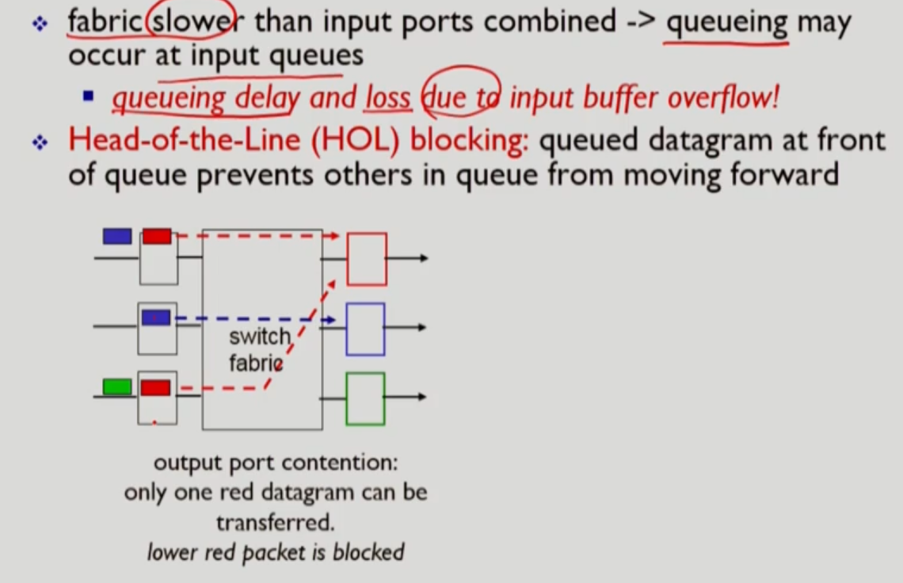

# 네트워크 키워드 정리

## RoadMap

> RoadMap
>
> 1. network
>    1. edge
>    2. core
>    3. delay, loss
> 2. protocol

### 1. packet delay가 어느 과정에 발생하는지 각각 설명하시오

| 단계 | delay                                                        | 설명                                                         |
| ---- | ------------------------------------------------------------ | ------------------------------------------------------------ |
| 0    | packet이 node에 전달되면 다음 노드 전송까지 delay가 발생한다 |                                                              |
| 1    | processing delay                                             | 1. bit error check 2. output link 결정                  |
| 2    | queueing delay                                               | 대기하는 packet이 있을 때 queue에 대기 **가변성**: 현재 congestion에 따라 달라짐 |
| 3    | transmission delay                                           | link에 전송할 차례일 때 전송하는 시간 L(bits)/R(bps) = 전송 속도 La(average packet arrival rate)/R = traffic intensity |
| 4    | propagation delay                                            | 물리적인 link 길이 / 전파속도 = d/s                          |

​                 

### 2. Throughput

* 처리량(Throughput): 단위시간 당 보낸 데이터양(bits/time unit)
* packet은 하나씩 전송되지만 연속적으로 보내기 때문에 흐름으로 생각할 수 있고 그 속도를 나타낼 수 있다.

​        

### 3. protocol은 어떤 형태의 구조며 이에 따른 장점과 단점은 무엇인가?

* complex system: layer system
  * 장점
    * identification, relationship 파악 용이
    * maitenance, updating 용이
  * 단점
    * 기능의 중복성이 발생 가능하다

​        

### 4. 5계층에 대해 설명하세요

* 5 계층

  | 계층        | 설명                                                         | 요약                                                      |
  | ----------- | ------------------------------------------------------------ | --------------------------------------------------------- |
  | application | 네트워크 어플리케이션 지원 오직 endsystem, host에서 적용 ex) FTP, SMTP, HTTP | 메시지 생성 Message                                  |
  | transport   | process(source)-process(destination) data transfer ex) TCP, UDP | host to host 헤더를 붙인 Segment 생성                |
  | network     | routing of datagrams from source to destination ex) IP, routing protocols | source to destination 다시 헤더를 붙인 Datagram 생성 |
  | link        | Data transfer between neighboring network elements ex) Ethernet, 802, PPP | node to node 헤더를 붙인 Frames 생성                 |
  | physical    | bits "on the wire"                                           | 물리적으로 비트를 싣는다                                  |

  ​             

### 5. application 계층

> Message를 만드는 계층이다.
> 통신하는 주체는 host(컴퓨터)가 아니라 그 내부에서 실행되는 program(process)이다.
> socket을 통해서 계층의 이동이 가능하다.

* application의 구조
  * client-server
    * server: 언제나 켜져있고(always-on), 영구적인 IP 주소를 가지며 data centers for scaling
    * clients: server와 통신하며 intermittentily(간헐적) 하게 연결하며 dynamic address를 갖는다.
  * peer-to-peer (P2P)
    * no always-on server, intermittentily connected, change IP address = 관리가 복잡하다
    * peer: self-scalability, 서로가 service를 provide할 수도 있고 request할 수도 있다.
* process
  * 종류: client-server에는 각각 역할에 맞는 프로세스가 있지만 P2P에는 두 프로세스 모두 존재한다.
    * client-process: communication을 시작하는 프로세스
    * server process: 접속을 기다리는 process
  * 프로세스 간 통신
    * Host의 주소는 IP로 나타낸다: 32비트 = 8비트 * 4, 최대수 255.255.255.255
    * Host의 IP 뿐만 아니라 어떤 프로세스인지 나타내기 위해 **port numbers**로 나타낸다.
      * ex) HTTP server: 80, mail server: 25
* app need services
  * data integrity: no loss, reliable transport
  * timing: low delay
  * throughput
  * security

​        

### 6. TCP가 UDP의 차이점을 말하고 이를 통해 어떤 종류의 통신에서 사용되는지 설명하시오

### Internet transport protocols services

* TCP

  > 전송속도가 가변적이기 때문에 streaming 에서는 오히려 약점이 되어 사용되지 않는다.
  > 단순 전송인 경우 서로의 정보를 유지하는 connection-oriented의 overhead 비중이 매우 커지므로 사용하지 않는다.
  > Apps: e-mail, remote terminal access, Web, file transfer

  * reliable transport
  * flow control: sending TCP 에서 receiving TCP로 보낼 때 queue에 빠르게 차는 경우 전송 속도를 줄이도록 요청
  * **connection-oriented**: 서로간 신원을 확인 (setup이 필요하며 관리하기 위한 overhead가 크다)
  * congestion control: network overloaded 시 sender에게 속도 줄이도록 요청

* UDP

  > Streaming에서 많이 사용: 데이터의 정확한 일치가 중요하지 않기 때문

  * unreliable data transfer
  * connection-oriented가 필요하지 않은 전송에서 사용된다.(단순 전송)

​         

### Application protocol

* TCP IP의 통신 순서

* Web

  * HTTP(HyperText Transfer Protocol)

    * web page는 objects로 구성되며 base HTML-file(several referenced objects = URL 형태)로 이루어짐

    * client-server model

    * use **TCP**: web은 data integrity가 중요하다. 

    * HTTP is stateless: server는 client의 이전 요청을 보관하지 않는다(보관시 overhead가 매우 큼 = 일치성 유지가 힘듦).

    * non-persistent HTTP: 여러 object가 있는 경우 TCP를 여러번 통신해야한다

      >1. HTTP client가 server에 TCP 연결을 요청
      >2. server는 (always-on이기 때문에) port 80번에서 TCP 연결을 "accepts"하고 client 확인
      >3. HTTP client는 (유저가 원하는 URL이 담겨진) request message은 TCP 연결에 생기는 TCP connection socket으로 들어간다.
      >4. client쪽의 socket의 정보는 server쪽의 socket으로 이동하고 server는 request Message에 따른 response Message를 socket으로 보낸다.
      >5. 전송 후 Server는 TCP Connection을 close
      >6. HTTP client는 response message를 바탕으로 html 파일을 구성해 보여준다.

      * RTT(definition): time for a small packet to travel from client server and back
    
      * HTTP response time: one RTT to HTTP request and first few bytes of HTTP responses to return
    
        * HTTP response time = 2RTT + file transmission time
    
          * 하나는 TCP 연결을 시작하고 하나는 file을 요청한다.
          * 각각의 TCP 연결에서 OS 오버헤드가 존재한다.
    
          
    
    * non-persistent HTTP: 여러 object를 보내기 위한 접속 유지
    
      > 1. 만약 5개를 요구한다면 1번의 연결 RTT에 의해 5개의 socket이 동시에 열린다.
      >
      > 2. 각 Object마다 2RTT 이상의 시간이 필요하며 연결마다 오버헤드가 발생한다.
      >
      > 3. 또한 버퍼도 각 socket마다 할당해야한다.
    
      * 다 보낸 이후에 server와의 연결 해제

​       

### HTTP request message

* 2 종류의 메시지 존재: request, response

  * ASCII: 사람이 읽을 수 있는 형식

  >첫번째 줄(request line): GET, POST / HEAD commands: URL / HTTP 버전
  >
  >* POST: form input으로 타이핑하는 내용을 `entity body`에 담는다.
  >* GET(URL): request line URL 부분에 `?`로 변수를 표기
  >* HEAD: **request를 보내지 않아도 된다는 뜻**, 주로 테스트용으로 사용(파일 주고 받기X)
  >* PUT, DELETE: HTTP/1.1에 추가된 Method
  >
  >그 이후: 한 개 이상의 header lines
  >
  >* Host: http 서버 주소
  >* language
  >* Connection 방식 (persistent 등)
  >
  >헤더 끝 표기: `\r\n`
  >
  >추가사항: entity body가 뒤에 있을 수도 있고 없을 수도 있다.

​         

### HTTP response message

> 첫번째 줄(status line): version / 200(서버상태)
>
> * 200 ok / 301 Moved Permanently / 400 Bad Request / 404 Not Found / 505 HTTP Version Not Supported
>
> 그 이후: 한 개 이상의 header lines
>
> * Date
> * Server: Apache
> * Content-length
> * Connection
> * **Content-Type**
>
> 헤더 끝 표기: `\r\n`
>
> Data requested HTML file: request의 entity body 처럼 긴 HTML 파일이 전송     

​      

### User-server state: Cookies

> HTTP는 stateless 해서 연결을 요청시에만 하지만 cookie를 통해 그 정보들을 유지하도록 한다.
>
> 쿠키의 4가지 구성요소
>
> 1. HTTP response 메세지에 cookie header line을 집어넣는다.
> 2. 한 번 response를 받은 이후부터 request에도 cookie **header line**(두번째줄 이상)을 포함해서 보낸다.
> 3. 브라우저는 cookie 파일을 유지한다.
> 4. 서버측에서는 back-end database에 유지한다.

*  cookie-specific action: 서버는 이미 부여한 쿠키 번호에 대해 특정해서 동작한다.

​        

### Cookie의 역할

1. authorization

2. shopping carts

3. recommendations

4. User session state (Web e-mail): 세션 유지, 이메일을 보내고 나서도 로그인이 유지되도록 한다.

   ​      

### Web caches (proxy server)

> 목적: 본 서버가 아닌 proxy server에서 저장된 request를 전송하는 것
>
> 기본 세팅: 웹 캐쉬를 통해서 먼저 접근하도록 한다.
>
> * 브라우저는 HTTP request에서 cache로 모두 받으려고 한다.

* Web Cache는 클라이언트인가 서버인가?
  * 두 역할 모두 가능해야한다. 본 서버를 기준으로는 클라이언트며 실제 클라이언트 기준으로 서버처럼 동작한다. 
* 웹 캐시를 사용하는 이유
  * 응답 시간이 짧아진다.
  * ISP에 정기적으로 돈을 내야하는데 웹 캐시를 사용하면 그 비용을 줄일 수 있다.
  * P2P나 poor content provider에게 유리
  * cache hit rate에 따라서 응답 시간이나 비용이 달라진다.
* 웹 페이지가 업데이트 된 경우를 파악해야한다.
  * Conditional GET
    * header line: `If-modified-since` 에 이전에 업데이트했던 시각을 보내고 서버는 그 이후에 업데이트가 있었는지 파악
      * 304 Not Modified: 업데이트가 되지 않았다는 신호
      * 200 OK: 업데이트가 되었다는 신호
    * delay를 두어서 업데이 확인 주기를 결정

​       

### Electronic mail

> commands(ASCII text) 와 response(status code and phrase)로 이루어진다.

> SMTP: simple mail transfer protocol
>
> User Agent가 보내고 User Agent가 수신한다.
>
> 이동마다 TCP 통신을 통해 socket을 만들고 메일 내용을 전송한다. **포트번호 25**
>
> 중간 중간 mail server를 지나가면서 message queue에 대기한 후 발송을 반복한다.
>
> mail server가 클라이언트 역할도 하고 server 역할도 한다.

* 메일 통신의 시작 부분

* User Agent
  * mail reader
* Mail Servers
  * mail box: 메일을 보관하는 역할
  * message queue: 메일 전송을 기다리는 곳 

​          

### SMTP 종류

* **POP3**: Post Office Protocol[RFC 1939] , 인증, 다운로드

  > 작동 순서: Authorization >> transaction
  >
  > 여러가지 방식: download and delete / download-and-keep

  * Authorizartion phase: 일단 인증을 받아야 메일 확인 가능
    * server response: + OK / - ERR
  * Transaction: 리스트를 받아오고 읽고 삭제하고를 반복
    * list / retr / dele / quit

* **IMAP**: Internet Mail Access Protocol [RFC 1730]: 메시지 서버에 보관 등 많은 특징

  * 서버에서 모든 메시지를 한 곳에 보관
  * 사용자의 ID과 보관된 폴더 이름과 매핑해서 가져오는 방식
  * POP3방식보다 복잡
    * Mail box를 정렬하기 위한 메서드가 필요하다.

* HTTP: gmail, hotmail, Yahoo!

​           

### HTTP 와 SMTP의 차이점

* HTTP: pull 프로토콜 (받기 위함), response 하나 당 object 하나
* SMTP: push 프로토콜 (보내기 위함), 메세지에 object 여러개

​          

### DNS: Domain name System

> 사람의 입장에서 많은 구분자가 존재한다: SSN, name, passport #
>
> IP 주소를 호스트와 매핑해주는 작업: IP 주소는 32비트
>
> Distributed database: name server에 계층적으로 존재

* DNS Service

  * Host Name to IP address translation
  * host Aliasing
    * canonical
    * alias names
  * mail server: 학교 등에서 사용하는 메일 서버를 알려준다.
  * load distribution: 복제본들을 여러개 가지고 있으며 계층적으로 정보들을 저장한다.
    * replicated Web server: 많은 IP 주소가 하나의 이름에 일치한다.
    * 계층적 구조(hierarchical database)
      * Root DNS 아래 com / org / edu DNS Servers 존재 (TLD: TOP LEVEL DNS SERVERS)

* DNS가 중앙화(centralize) 할 수 없는 이유

  * 트래픽 크기
  * 위험성: 고장나면 모두 마비
  * 거리
  * 유지보수

* Local DNS name Server (=default name server, proxy)

  * 각각의 ISP 가 가지고 있다.
  * 그래서 DNS를 검색하기 위해 먼저 local로 접근하며 쿼리가 존재하면 반환한다.

* TLD, authoritative servers

  > Top-level domain(TLD) servers: 관리하는 기관들이 각각 존재, authoritative servers 를 저장하고 있다.
  > authoritative servers: 각 기관이 자기 자신 이름을 가지는 DNS 서버 매핑관리 

  ​        

* ### DNS 의 단계는 3단계

  > 계층적으로는 = root - TLD / local - authoritative DNS Server >> requestiong server

  #### - 방식 2가지

  1. Iterated query
     * **iterated query**: 접속한 서버가 다른 서버에게 묻는 구문
     * **사용자 입장에서는 local에게 요청한다**
       * local은 자신이 모르면  root에게 묻는다.
         *  root는 해당하는 TLD서버 주소를 알려준다
       * local은 받은 TLD주소로 다시 요청한다
         * TLD는 authoritative의 주소를 알려준다
       * aithorative를 통해 해당 주소를 얻어낸다.
  2. recursive:  어떻게든 구해서 반환하는 방식
     * recursive: 자기가 직접 찾아내는 방식
       * local에 방문 - root DNS 방문 - TLD 방문 - authoritative DNS 서버 방문

  ​         

  ### DNS Caching, updating records

  * 한번 방문한 웹 서버를 저장: local에 TLD 서버를 기록 = **root 방문X**
  * 캐싱에서 out-of-date 문제가 발생할 수 있다.

  ​          

  ### DNS protocol, message

  * query and reply message, both with same message format
    * Msg header: identification[16비트의 쿼리], flags[ 내용들: query/reply, recursion desired, available, reply is authoritative]

  

  ​     

### Client/Server socket interaction: UDP

#### - UPD

> Client & Server 사이에 연결(Connection)이 존재하지 않음

* client는 socket을 열고 server IP와 port를 지정해서 보낸다.
* server가 socket을 통해 client 주소와 port 를 읽고 다시 재전송한다.
* Header size가 작다 = UDP segment의 header 가 작다 = 오버헤드가 작다

* 구현(Python)

  

  * 서버는 while 1: 을 통해 계속 루프를 돌리면서 통신을 기다린다.

#### - TCP

* Server 역시 먼저 구동 중이어야 한다: socket 을 통해 client를 대기
* Client: IP 주소와 port번호 특정
* Server 는 이 client와 연결할 유일한 socket을 만든다.
* 통신이 끝나면 서버는 연결을 위해 만들었던 socket을 close 한다.
* 

​           

### 2장 요약

​               

## 3. Transport Layer

> application 간의 logical process 를 제공한다.

* Socket 통신: Multiplexing/demultiflexing

  * 서버 안에 application이 여러개 존재
    * multiflexing: application에서 transport layer로 내려보낼 때 transport header 추가
    * demultiflexing: application에서 받을 때 이전에 기록한 transport header에 있는 주소를 읽고 socket으로 보낸다.

  

  

* UDP checksum

  > UDP 전송에서 segment의 header를 이용해 error를 찾아내는 방식
  > sender는 UDP checksum 에 값을 집어넣고 받을 때 integer 값들을 더해서 검사

* TCP Sequence number(통신 순서넘버) ACK NUMBER(잘 받았다는 확인)
  * 둘 다 바이트 단위로 넘버링: 보내는 패킷의 넘버
  * Flow control

​      

### TCP와 UDP의 공통점들, 차이점들

* 공통점
  * Transport Layer
    * segment에 header와 tail이 존재
    * Dest port,IP, Source Port, IP 필요
* TCP의 고정헤더: 5개 (각 32bits = 4bytes = 4x5 = 20bytes)

​           

### TCP round trip time, timeout

* 과거의 round trip time을 이용해 다음번의 round trip time을 구한다.
* **timeout interval**
* 순서:
  * segment를 생성함과 동시에 checksum + seq # 를 생성 = 보낸다
  * timer가 켜져있지 않았다면 timer를 킨다.(**내보낸지 제일 오래된 segment에 타이머를 붙인다.**)
  * timeout 발생: 가장 오래된 segment가 ack 을 안보내는 경우에 발생
  * Ack #  번호가 왔음 = 그 번호까지 잘 전송된 것 = 정보를 업데이트하고 segment가 모두 전송되었다면 새로운 timer를 다시 세팅해서 뒤 segment를 보내고 기다린다.

​        

### reliable data를 위한 TCP의 요소

1. checksum
2. ack #
3. pipelining
4. Sequence #
5. Timer : single retransmission timer (하나의 타이머를 사용한다.)

​        

### TCP sender 정리

* Next Sequence Number와 SendBase에 의존
  * NextSeq #: 다음번 내보낼 segment의 시퀀스 번호 = 현재 NextSeqNum + length(data)
  * SendBase: 다음번 Ack을 기다리고 있는 sequence 번호
* Start Timer: 내보낸 segment 중 가장 오래된 segment
* ACK received
  * ACK이 좀 느리게 오면 데이터를 잘 받았더라도 timeout이 발생해서 데이터를 다시 보낸다.

​         

### TCP receiver

* sender가 보낸 data 신호가 Network 계층에서 TCP(Receiver)로 올라온다.

* **ACK을 모두 다 보내고 초기화 상태일 때 segment를 받는다면 바로 socket을 열지 않고 일단 기다린다.**

  * 왜냐하면 sender가 보낸 신호가 여러 개일 수 있기 때문에 cumulative 를 이용해 한꺼번에 보낼 수 있기 때문이다.(500ms)
  * 기다리다 하나 더 들어오면 즉시 single cumulative ACK를 보낸다.

  

  * 만약 더 오지 않으면 바로 ACK을 보낸다.
  * 순서대로 오지않고 따로따로 왔다면(out of order) 빠진 부분을 받기 위해 **duplicate ACK**를 보낸다.

​         

### TCP fast retransmit

> timeout이 발생하기 전에 duplicate ACKs 를 토대로 data를 재송신하는 방법

* Time-out 시간은 상대적으로 길다(relatively long)
* **duplicate ACK**를 통해 lost segments들을 파악한다.
  * 누락된 data 이후에 ACK #는 모두 duplicate로 대체된다.
    * 3번이상 duplicate ACK를 받으면 timeout이 발생하기 전에 재송신한다.

​         

### TCP flow control

* TCP socket receiver buffers: application으로 바로 보내는 것이 아니라 buffer에 넣고 전송한다.
  * 만약 아래에서 송신하는 data가 더 많으면 buffer가 찬다.
  * 이런 일이 발생하지 않도록 **flow control**을 한다.
* 남은 buffer의 공간(길이)를 rwnd로 나타내고 data를 내볼 때 이 rwnd 값을 같이 보낸다.

​          

### TCP 3-way hanshake

> 먼저 **ESTAB** 되는 쪽이 Client인 이유: timeout 등으로 서버가 닫히면 Failure 발생하기 때문이다.

* 2단계로 나누었을 때 발생하는 문제

  * client가 연결 요청을 보낸다. (SYN msg = Synchronzing msg)
  * 서버가 동의(SYN ACK)하고 동의한 내용을 client가 뒤늦게 확인한다 (서버는 이미 Established)
    * 근데 client가 보내는 자료가 너무 늦으면 서버가 닫히고 이후 데이터에 대해서 서버는 다시 새로운 신호로 받아들여 라인이 새로 만들어진다. = 낭비

  

* 3 단계

  * client가 seq #을 보내고 server가 받는다.
  * server가 동의하고 client에게 ACK # 를 보내면 client가 먼저 ESTABLISH 하고
  * 다시 client는 server에게 ACK를 보내는데 이것을 받으면 서버가 ESTAB된다.

          

​        

### TCP: closing connection

* Finally bit = 1 / seq = x 을 보내면 이에 대해 ACK #를 보내준다.
* client 쪽에서 보내는 신호이다.
* 서버는 이것을 받고 ACKbit = 1 와 ACKnum = x+1을 보내준다.
* 다시 서버는 ACKbit = 1, ACKnum = y+1을 보낸다.
  * 이를 받고 서버측에서 CLOSED 한다.
  * 보낸 client는 바로 close하지 않고 2*max segment lifetime 만큼 기다린다.
    * ACK가 server에 전달되지 않는 경우가 있는데 그러는 경우 server가 닫히지 않기 때문임

​          

### Congestion

> 데이터가 지체되거나 소실될 수 있는 문제 발생

* congestion이 발생하면 **retransmission** 가능성이 높아진다.
  * 너무 느린 나머지 불필요한 retransmit이 발생가능
  * 필수적인 일을 못하는 경우가 발생
* 해결책 2가지

​     

* approach: sender increase transmission rate
* TCP의 sending rate(전송속도) 조절:
  * rate = cwnd/RTT bytes.sec
* cwnd 의 크기 조절: 1 MSS 로 시작해서 매 RTT마다 2배씩 늘린다
  * 처음 연결에는 **Slow start**지만 2배씩 늘어나므로 금방 증가한다.
  * Congestion Avoidance: 충분히 크다면 조심해야한다.
    * ssthresh: cwnd가 속도를 줄이는 default value 값
    * ssthresh를 도달한 이후에는 RTT마다 1개씩 증가시킨다. 

​        

### TCP: data detecting / loss 감지 요약

* timeout: loss 발생시
  * cwnd: 1로 초기화
* TCP RENO:
  * 3duplicate ACKs 발생시 현재 cwnd를 반으로 줄인다.
* TCP Tahoe: timeout이나 3 duplicate ACKs 발생시: cwnd = 1로 초기화

​        

### TCP performance : throughput / Fairness

* throughput: high speed level의 전송에서는 loss가 매우 적어져야한다.
* Fairness: 거리가 비슷한 host로 부터 데이터들이 송신될 때 라우터에서 엇갈린다.
  * 두 connection이 거리가 비슷한 경우 unfair하게 시작해도 TCP 구조상 속도 증감을 반복하며 결국 같아진다.

​                 

​           

## network 계층

> Transport 계층의 segment 를 sending host에서 receiving host로 전송
>
> 보내는 입장: segment을 datagram으로 encapsulate
>
> 받는 입장: segment를 transport layer로 전달
>
> router : IP datagrams의 header를 보고 어디로 보낼지 결정

* 가장 큰 기능 2가지

  * Routing: 목적지를 계산하는 것
    * routing algorithm: end-end-path를 계산
  * forward: router의 input 과 output이 있는데 input으로 들어가면 적절한 output으로 옮겨주는 역할
    * forwarding table이 존재해서 header에 번호에 맞추어 outputlink가 저장되어있다.

* 서비스 모델

  * 각 데이터그램
    * delivery 보장
    * 40msec delay 안에서 delivery qㅗ장
  * flow of 데이터그램

* Connection / connection-less

  > TCP/UDP: 프로세스 to 프로세스
  >
  > Datagram: 호스트 to 호스트

  * datagram: connection-less

  * Virtual-circuit: connection-oriented

    * call setup, teardown: 데이터를 보내기 전에 매번 수행

      * call setup: 다음 이동할 라우터에다 그 다음 callsetup 을 위한 VC 넘버를 새로 갱신

      

    * VC 번호 할당, path, forwarding table에 저장

      * 패킷은 VC number를 목적지 path가 아닌 VC number 를 가지고 찾아간다.
      * 매 link마다 VC number가 바뀔 수 있다.
        * 만약 같은 VC넘버를 사용하는 경우: 더 긴 VC번호가 필요하다. (전체에서 VC link별로 unique 해야하므로)

* signalling protocols

  * VC 의 매 통신마다 call setup을 하기 때문에 protocol 이 필요하다.

    * 실 사용 예) ATM, frame-relay, X.25

  * Datagram: call setup 이 전혀 없다

    * Forwarding table만 사용한다.

      * 4billions IP 주소가 필요하기 때문에 목적지를 묶은 범위로 점점 세부적으로 찾도록 구성한다.

        

        ​       

​            

### Datagram 과 VC network 비교

* Datagram: smart end Systems: 개속적으로 발전한다.
* ATM: dumb end systems

​           

### Router Architecture

> Routing, forwarding 이 핵심이다.

* Routing: management control plane, software에서 작업

* Forwarding: data plane, hardware에서 작업

  * input port

    * Line termination [물리 계층]: 전송은 물리계층으로하므로 일단 물리계층에서 받고 점차 올려준다.
    * Link layer protocol [링크 계층]
    * Lookup: forwarding table을 참고해 output port를 찾는다. [네트워크 계층]
      * 버퍼에 넣는 이유: lookup 시간보다 더 빨리 datagram이 오는 경우 고려

    

    * 

  * Switching fabrics

    * input buffer에서 output buffer로 packet을 이동시킴 
      * Switching via Memory: 이동시킬 때 바로 버퍼간 이동하는 것이 아니라 메모리를 거쳐서 메모리에 저장한 후에 다시 버퍼로 이동
        * 단점: 메모리의 bandwidth에 제한, bus(선 이동)을 두 번 거친다.
      * Switching via a Bus: 공유되어진 bus를 통해 datagram을 전달.
        * 단점: 버스의 bandwidth에 제한
        * 장점: 기업이 사용하기에 충분한 속도와 접근성
      * Switching via interconnection network: overcome bus bandwidth limitations
        * datagram을 고정길이의 cell로 나누어 사용하면 프로세싱이 유리

  * output ports

    

    * datagram buffer : [네트워크 계층] : 아래 transmission rate 를 추월할 수 있기 때문에 대기하도록 한다.

      * FirstCome First Served가 아니라 더 복잡한 알고리즘을 통해 내보내는 순서를 정할 수 있다.

        

        * 버퍼의 크기 계산도 중요한 엔지리어링 기술이다.

    * Link layer protocol : [링크 계층]

    * Line termination: [물리 계층] - 전송하기 전에 물리 계층으로 내려주어야 한다.

​           

### network layer의 Internet protocol

* IP protocol : data plane (hardware)

  * IP fragmentation

    * MTU(max.transfer size): largest possible link-level fram
    * large IP datagram devide within net
      * 나뉘어서 종착지에서 모두 모인다.
      * 나누는 것마다 다시 헤더를 붙여주어야 한다.

  * IP address: 32 bit

    * host와 router interface의 identifier
    * Interface: connection between host/router and physical link

  * Subnets

    

| 키워드                        | 단원           | 설명                                                         | 관련 키워드                                                  |
| ----------------------------- | -------------- | ------------------------------------------------------------ | ------------------------------------------------------------ |
| RTT                           | 1. RoadMap     |                                                              |                                                              |
| packet delay                  | 1. RoadMap     | **d**node =  **d**process + **d**queue + **d**trans + **d**prop | loss                                                         |
| Packet loss                   | 1. RoadMap     | packet 양이 queue 크기의 한계를 초과하면 packet이 소실된다   | delay                                                        |
| Throughput                    | 1. RoadMap     | packet은 하나씩 전달되지만 연속적으로 전송하기 때문에 단위 시간으로 묶는 경우 전송 속도를 나타낼 수 있습니다. |                                                              |
| protocol                      | 1. RoadMap     | protocol 은 layer system으로 구성되어 있다.                  |                                                              |
| 5 계층                        | 1. RoadMap     | application, transport, network, link, physical              |                                                              |
| malware                       | 1. RoadMap     | virus: executing시 활성화 warm: receiving시 자동 실행   |                                                              |
| Dos                           | 1. RoadMap     | Denial of Service의 약자 Host 주변을 malware을 통해 감염시킨뒤 botnet으로 만들어 garbage traffic을 계속 생성해 처리량을 넘는 traffic 발생 |                                                              |
| sniffing                      | 1. RoadMap     | Broadcasting(WIFI, shared ethernet) 환경에서 promiscuous(관리자) 모드로 전송되는 데이터를 조사 | NIC                                                          |
| IP spoofing                   | 1. RoadMap     | 자신의 IP 주소를 속여 데이터를 받는 방식                     |                                                              |
| process                       | 2. Application | host에서 실행되는 프로그램                                   | client-process server process                           |
| socket                        | 2. Application | 계층 간 정보 이동은 socket을 통해 이루어진다. TCP 통신에서 양쪽에 TCP connection socket이 생긴다 | TCP                                                          |
| RTT                           | 2. Application | Round Trip Time, client 에서 출발한 패킷 하나가 server에 도달하고 다시 되돌아 오는 시간 | HTTP response time                                           |
| HTTP response time            | 2. Application | RTT가 TCP 연결 요청을 시도해서 request(요청)을 받기까지 걸리는 시간 2 RTT (TCP + File) + file Transmission | RTT                                                          |
| GET                           | 2. Application | URL method, HTTP request line에 있는 URL에서 `?`를 통해 값을 전달하는 방식 | POST HEAD                                               |
| POST                          | 2. Application | HTTP Headlines 뒤에 entity body 부분에 저장해 내용을 전달하는 방식 | GET HEAD                                                |
| HEAD                          | 2. Application | response를 받지 않아도 된다는 method로 file transmission이 발생하지 않는다. 주로 TEST 목적으로 사용 | GET POST                                                |
| PUT                           | 2. Application | Server URL에 client가 파일을 업로드한다. 보통 서버를 관리하는 client 에 부여한다. | DELELTE                                                      |
| DELETE                        | 2. Application | Server URL에 있는 파일의 삭제를 요청한다.                    | PUT                                                          |
| Cookie                        | 2. Application | HTTP 통신에서 stateless한 연결방식을 보완하기 위해 client-server가 서로 유지하는 정보 |                                                              |
| SMTP                          | 2. Application | Simple mail transfer protocol                                | User Agent Mail servers Mail port 25 POP3 IMAP |
| POP3                          | 2. Application | Post Office Protocol, Authorization 과 Transaction 의 순서대로 메일을 읽어오는 방식 서버 입장에서 단방향으로 보내고 메시지를 삭제하거나 keep을 결정 | SMTP IMAP                                               |
| IMAP                          | 2. Application | Internet Mail Access Protocol, 메일 서버에 모두 저장되고 사용자의 ID와 폴더이름을 매핑해서 불러오는 방식 서버와 사용자간의 양방향 통신으로 매핑을 한다. | SMTP POP3                                               |
| DNS                           | 2. Application | Domain Name system, hostname 을 IP주소로 매핑하고 그 정보를 분산해서(distributed) 데이터베이스에 계층적으로 저장해 검색하는 시스템 |                                                              |
| TLD                           | 2. Application | Top-level domain servers, authoritative servers 의 주소들을 저장하고 있다. | local DNS servers root name servers는 13개              |
| iterative query               | DNS            | 내가 주소를 요청한 서버가 다른 서버들에 요청해 다시 나에게 반환하는 방식 | recursive query                                              |
| recursive query               | DNS            | 내가 직접 local서버부터 찾아서 host 주소를 알아내는 방식     | iterative query                                              |
| UDP                           | 3. Transport   | User Datagram Protocol Client & Server 사이에 연결(Connection)이 존재하지 않음 unreliable datagram (=no handshaking) UDP segment 개별 전송(순서 고려X) | `.bind` & `listen` IP address & port number client port #  표기X |
| TCP                           | 3. Transport   | Client & Server 별도의 socket을 열고 연결하는 방식 reliable, bytes stream-oriented, in-order, pipelined, full duplex data(client도 수신 가능) | `.bind` & `listen` IP address & port # 고정헤더    |
| network layer                 | 2. Application | logical communication between hosts                          |                                                              |
| Transport layer               | 3. Transport   | Process to Process, logical communication between processes  | UDP TCP                                                 |
| Multiflexing                  | 3. Transport   | Transport layer 에서 핵심적인 system process(application, sender)가 transport header를 붙이고 서버는 이 header를 이용해 source port와 dest port를 인식한다. | segment demultiflexing                                  |
| demultiflexing                | 3. Transport   | host(server) 가 segment의 destination port # 를 확인한다. 그 port에 해당하는 socket으로 전달한다. |                                                              |
| (SNMP)                        | 3. Transport   | periodically 정보 교환                                       |                                                              |
| UDP checksum                  | 3. Transport   | UDP 전송에서 segment의 header를 이용해 error를 찾아내는 방식 무결성 검사  | IPv4 Pseudo Header                                           |
| Sequence number               | 3. Transport   | Byte stream "number" of first byte in segment's data segment에 실려있는 데이터 첫 부분의 number ackowledgements: 난수인 ISN(Initial Sequence Number)가 결정되고 해당 번호부터 순서가 시작되어 Sequence Number(raw)가 된다.(해킹 방지) | TCP ACK number                                          |
| ACK number                    | 3. Transport   | ackowledgements:                                             | Cumulative ACK                                               |
| duplicate ACKs                | 3. Transport   | TCP data 가 out of order 로 도착했을 때 보내는 ACK 번호      | TCP fast retransmit                                          |
| negotiate                     | 3. Transport   | TCP가 data를 송신할 때 sequence number을 결정하는 것 Receiving Buffer의 길이(rwnd) 등을 고려해 데이터 흐름 제어 결정 | Flow Control                                                 |
| Flow Control (흐름제어)       | 3. Transport   | 송신측과 수신측의 데이터 처리 속도 차이를 해결하기 위한 기법 Receiving Buffer에 쌓이는 데이터를 조절한다. 끊임없이 증가하고 감소하는 것을 반복한다. | stop and wait  sliding window TCP                  |
| Congestion Control (혼잡제어) | 3. Transport   | 송신측의 데이터 전달과 네트워크의 데이터 처리 속도 차이를 해결하기 위한 기법 | TCP                                                          |
| TCP fast retransmit           | 3. Transport   | timeout이 발생하기 전에 duplicate ACKs 를 토대로 data를 재송신하는 방법 | triple duplicate ACKs                                        |
| AIMD                          | 3. Transport   | Additive increase multiplicative decrease                    | TCP congestion control                                       |
| rwnd / cwnd                   | 3. Transport   | rwnd: flow control cwnd: congestion control (1 MSS, 1 maximun segment size) | ssthresh                                                     |
| ssthresh                      | 3. Transport   | cwnd가 속도를 줄이는 default value 값 loss가 발생한 cwnd 값의 절반으로 재설정한다. | congestion avoidance                                         |
| TCP RENO TCP Tahoe       | 3. Transport   | timeout이나 3 duplicate  발생시 cwnd 를 줄이는 방식 TCP RENO: 절반으로 줄임 TCP Tahoe: 1로 초기화 | ssthresh                                                     |
| window size                   | 3. Transport   | Loss 가 발생하는 window size                                 |                                                              |
| datagram                      | 4. Newwork     | segment에 header를 붙여 Network 계층으로 이동하는 데이터(?)  |                                                              |
| Routing                       | 4. Newwork     | Routing algorithm을 통해 end 에서 end까지의 path를 계산      | forwarding                                                   |
| forwarding                    | 4. Newwork     | forwarding table을 이용해 router에 input으로 들어온 패킷을 적절한 output으로 이동시킨다 | routing                                                      |
| Virtual circuit               | 4. Newwork     | Connection-oriented, 데이터를 보내기 전 call setup과 teardown을 반복합니다. call setup: 패킷 입장에서 다음 라우터에게 VC 넘버를 새로 받아내는 것 | call setup                                                   |
| IP protocol(인터넷 프로토콜)  | 4. Newwork     | 송신 호스트와 수신 호스트가 패킷 교환 네트워크(패킷 스위칭 네트워크, Packet Switching Network)에서 정보를 주고받는 데 사용하는 정보 위주의 규약(프로토콜, Protocol) | Data plane IP fragmentation, reassembly MTU        |
| interface                     | 4. Newwork     | connection between host/router and physical link 라우터와 호스트 물리적 링크 간 연결관계 (host는 보통 1~2개의 interface를 가진다: wired Ethernet, wireless) | IP address                                                   |
| subnet                        | 4. Newwork     | **적절한 단위로 네트워크를 분할해야할 필요성**이 생기게 된다. 이러한 이유로 인해서 서브넷의 개념이 탄생하게 된다. **서브넷(Subnet)이라는 것은 하나의 네트워크가 분할되어 나눠진 작은 네트워크**이다. IP 주소에서 같은 서브넷 부분으로 이루어진 device interfaces | interface                                                    |
| CIDR(사이더)                  | 4. Newwork     | Classless InterDomain Routing, 클래스 없는 도메인 간 라우팅 기법으로 1993 도입되기 시작한, 최신의 IP 주소 할당 방법이다. 사이더는 기존의 IP 주소 할당 방식이었던 네트워크 클래스를 대체하였다. 사이더는 IP 주소의 영역을 여러 네트워크 영역으로 나눌 때 기존방식에 비해 유연성을 더해준다. | IP addressing 부족해지는 IPv4 주소 효율적 사용 접두어를 이용한 주소 지정 방식(광역 라우팅 부담 저하) |
|                               |                |                                                              |                                                              |
|                               |                |                                                              |                                                              |
|                               |                |                                                              |                                                              |
|                               |                |                                                              |                                                              |

